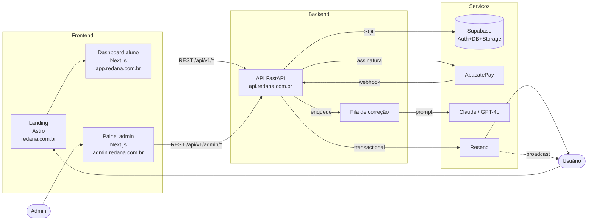
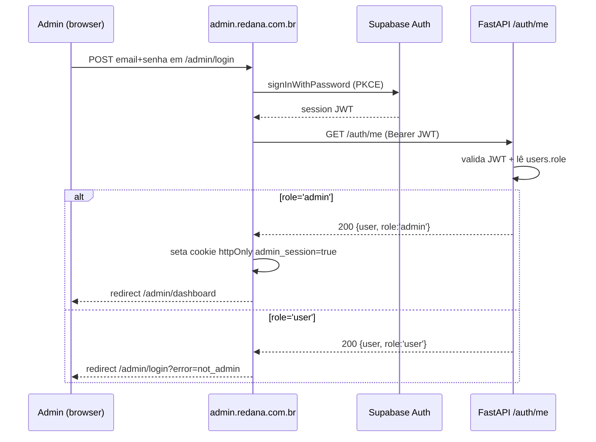
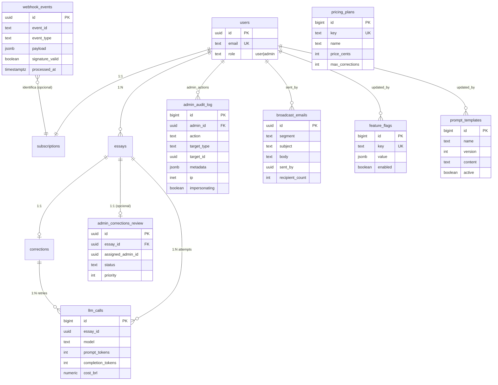
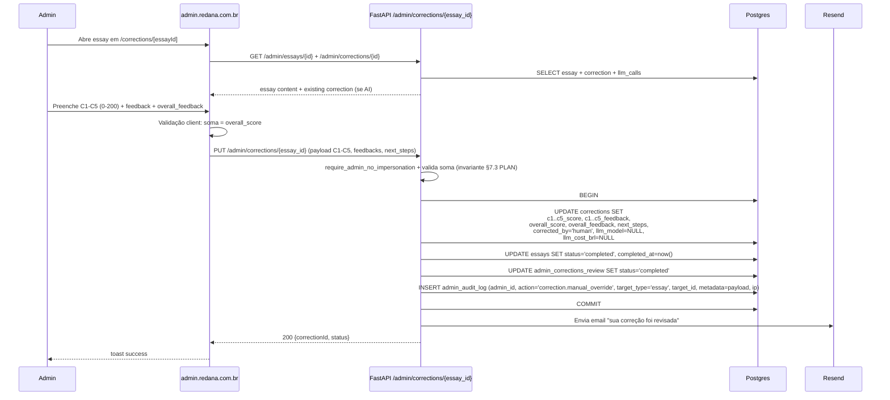
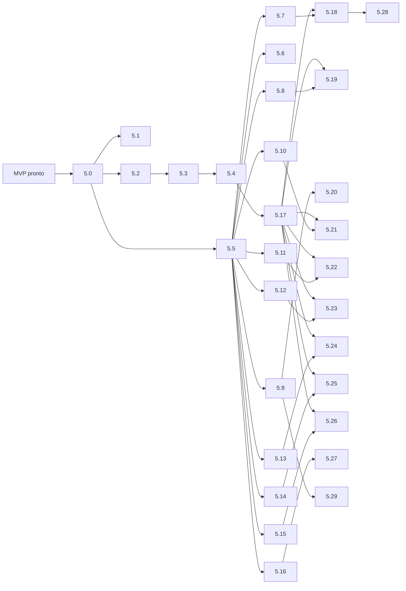

# Redana — Adendo de Arquitetura: Painel do Administrador (v1.0)

> **Adendo ao `PLAN.md` v1.1** — promove o Painel Admin (anteriormente uma linha vaga em "Fase 5 pós-MVP") a feature legítima, projetada e construtível.
>
> **Versão:** 1.0
> **Data:** Julho de 2026
> **_alvo de salvamento:_: `C:\Users\Alexsander\Desktop\redana\docs\admin-architecture-addendum.md`
> **Alinhado com:** `PLAN.md` seções 4, 6, 7, 8, 12, 15

---

## Sumário executivo

Este adendo documenta, em 11 seções, a arquitetura do Painel do Administrador Redana: tópicos incluem **decisão de onde a UI admin vive** (app separado `apps/admin` vs. rota `/admin` dentro de `apps/web`), o **modelo RBAC** sobre `users.role`, **DDLs novas** (`admin_audit_log`, `feature_flags`, `prompt_templates`, `broadcast_emails`, `admin_corrections_review`), os **contratos de API admin** sob `/api/v1/admin/*`, as **queries SQL de analytics**, o **fluxo de correção humana**, o **fluxo de impersonação**, a **política de audit log**, a **revisão da Fase 5** em tarefas concretas, **riscos específicos** e **perguntas em aberto**.

**Decisão recomendada (resumo):** app Next.js separado `apps/admin` em `admin.redana.com.br`. Justificativa completa na §1.

---

## 1. Decisão: onde fica a UI do admin?

### 1.1 Opções avaliadas

| Critério | (a) App separado `apps/admin` @ `admin.redana.com.br` | (b) Route group `/admin/*` dentro de `apps/web` |
|---|---|---|
| **Isolamento de auth** | Próprio cookie de sessão, próprio redirect, sem compartilhar state com sessão do aluno._COOKIE separado por domínio. | Mesma sessão Supabase do dashboard; risco de escalonamento de privilégio por bug de middleware. |
| **Risco de vazar código admin no bundle do aluno** | Zero — build/deploy independentes; `apps/admin` never bundled into `apps/web`. | Médio — fat chunks com `import()` ou lazy gates; risco de leitura de admin pages por source map. |
| **CORS e origens confiáveis** | API pode allowlistar `Origin: https://admin.redana.com.br` para rotas `/admin/*` — defesa em profundidade. | API precisa distinguir "mesma origem da web" mas role admin — depende só de JWT, sem defesa por origem. |
| **Deploy e escala independentes** | Sim: admin pode ficar behind VPN / IP allowlist / Vercel project separado, sem afetar aluno. | Não: deploy único; admin uptime = uptime do dashboard do aluno. |
| **Reuso de código (`packages/shared`, `packages/db`, `packages/email`)** | Total — monorepo permite import dos mesmos packages. | Total. |
| **Esforço inicial** | Moderado: novo app Next.js, configs, pipeline, domínio DNS. | Menor: rota a mais em app existente. |
| **Isolamento de incidente** | Comprometimento do admin não expõe superfície do aluno no mesmo bundle; separação clara para auditoria. | Comprometimento afeta ambos. |
| **UX para o owner** | Logout do dashboard do aluno e login no admin como ação deliberada (segurança). | Troca de contexto fluida (conveniência, risco). |

### 1.2 Recomendação

**RECOMENDADO: opção (a) — app Next.js 14 separado `apps/admin` em `admin.redana.com.br`.**

Justificativa ancorada na escala Redana:

1. **Single-owner admin inicialmente**, mas separar desde o dia 1 evita migração cara depois. O custo incremental de um app Next.js extra no monorepo é ~1-2 dias (configurado uma vez), enquanto sair de `/admin/*` para app separado no futuro significa reescrever rotas, refatorar middleware e invalidar cookies em produção.
2. **Princípio de menor privilégio na superfície**: rotas `/api/v1/admin/*` no FastAPI podem ser trancadas por `Origin: https://admin.redana.com.br` no CORS — uma defesa que a opção (b) não oferece porque o aluno e o admin dividem origem.
3. **Segregação de cookies**: Sessões httpOnly separadas por domínio impedem que um XSS no dashboard do aluno vire token de admin.
4. **Isolamento de bundle**: o código de correção humana,鞭 forms administrativos e listagens de todos os usuários nunca entram no JS enviado ao navegador do aluno — protege a arquitetura e reduz a superfície de ataque.
5. **Mitigação operacional futura**: quando a Redana crescer, `admin.redana.com.br` pode ser posto behind IP allowlist / Cloudflare Access / mTLS sem mexer no dashboard do aluno.

### 1.3 Subdomínio e deploy

- **App:** `apps/admin` Next.js 14 App Router.
- **Domínio:** `admin.redana.com.br` (DNS CNAME para Vercel project separado).
- **Vercel:** segundo project conectado ao mesmo repo monorepo, `Root Directory: apps/admin`.
- **Variáveis de env:** `NEXT_PUBLIC_SUPABASE_URL`, `NEXT_PUBLIC_SUPABASE_ANON_KEY` (mesmas do web), `NEXT_PUBLIC_API_URL=https://api.redana.com.br`, `ADMIN_IP_ALLOWLIST` (opcional — ver pergunta aberta §11).
- **Build:** `turbo build --filter=@redana/admin`.

### 1.4 Estrutura de pastas adicionada ao monorepo

```
apps/
└── admin/                         # Next.js 14 — Painel do administrador
    ├── src/
    │   ├── app/
    │   │   ├── layout.tsx          # Shell admin (sidebar admin)
    │   │   ├── page.tsx            # Redirect → /admin/dashboard ou /admin/login
    │   │   ├── (auth)/
    │   │   │   ├── layout.tsx
    │   │   │   └── login/page.tsx  # Login admin (role-gated)
    │   │   └── (panel)/
    │   │       ├── layout.tsx      # Sidebar + audit banner
    │   │       ├── dashboard/page.tsx       # Analytics
    │   │       ├── users/
    │   │       │   ├── page.tsx             # Lista + busca
    │   │       │   └── [id]/page.tsx        # Detalhe: redações + sub
    │   │       ├── essays/
    │   │       │   ├── page.tsx             # Filtros por status
    │   │       │   └── [id]/page.tsx        # Conteúdo + correção + reprocessar
    │   │       ├── corrections/
    │   │       │   ├── page.tsx            # Fila de correção humana
    │   │       │   └── [essayId]/page.tsx  # Form C1-C5 + feedback
    │   │       ├── subscriptions/
    │   │       │   ├── page.tsx
    │   │       │   └── [id]/page.tsx       # Forçar status, grant, extender, refund
    │   │       ├── payments/
    │   │       │   └── page.tsx            # Webhook event log + reconcile + failed
    │   │       ├── content/
    │   │       │   ├── prompts/page.tsx    # CRUD prompt_templates
    │   │       │   ├── plans/page.tsx      # CRUD pricing plans
    │   │       │   └── flags/page.tsx      # CRUD feature_flags
    │   │       ├── emails/
    │   │       │   ├── page.tsx            # Compose broadcast
    │   │       │   └── history/page.tsx    # Sent log
    │   │       └── system/
    │   │           ├── logs/page.tsx       # API logs (Sentry/Logflare embed/links)
    │   │           ├── health/page.tsx     # Health checks
    │   │           └── env/page.tsx        # Env info (sem secrets)
    │   ├── components/
    │   │   ├── ui/                          # Button, Card, Modal, Table, ...
    │   │   ├── corrections/
    │   │   │   ├── HumanCorrectionForm.tsx   # C1-C5 inputs 0-200
    │   │   │   └── CorrectionDiffBadge.tsx  # 'human' vs 'ai'
    │   │   ├── analytics/
    │   │   │   ├── MrrChart.tsx
    │   │   │   ├── ActiveSubsCard.tsx
    │   │   │   ├── ConversionFunnel.tsx
    │   │   │   ├── CorrectionsPerDay.tsx
    │   │   │   ├── LlmCostPerDay.tsx
    │   │   │   └── LatencyFailureRate.tsx
    │   │   ├── users/
    │   │   │   ├── UserTable.tsx
    │   │   │   └── ImpersonateButton.tsx
    │   │   └── audit/
    │   │       └── AuditLogTable.tsx
    │   ├── lib/
    │   │   ├── supabase/
    │   │   │   ├── client.ts
    │   │   │   ├── server.ts
    │   │   │   └── middleware.ts   # role check
    │   │   ├── api.ts              # fetch wrapper c/ header X-Admin-Impersonation
    │   │   └── rbac.ts             # helpers requireAdmin()
    │   ├── middleware.ts           # session + role='admin' gate
    │   └── next.config.js
    └── package.json
```

### 1.5 Diagrama atualizado do sistema



---

## 2. RBAC e modelo de auth

### 2.1 Coluna `users.role`

- Adicionamos `role text not null default 'user' check (role in ('user','admin'))` em `users`.
- Default `'user'`. Acesso admin só se `role='admin'`.
- Promoção a admin é feita DIRETAMENTE no banco por script operacional (`UPDATE users SET role='admin' WHERE email='owner@redana.com.br'`) — não existe endpoint público de auto-promoção.
- RLS adicional: tabela `users` ganha policy que usuário comum só vê a própria linha; linhas de outros usuários são visíveis apenas via service role (admin API).

### 2.2 Fluxo de login admin (separado)



- **Mesmo provedor Supabase Auth** — não duplicamos identidade. A diferença é o gate de role após o login.
- Cookies de admin ficam em domínio `admin.redana.com.br`, **separados** dos cookies de `app.redana.com.br`.
- `apps/admin/middleware.ts` valida sessão + `role='admin'` em todas as rotas `(panel)/*`. Se role≠admin → redirect `/admin/login`.

### 2.3 Dependência FastAPI `require_admin`

```python
# apps/api/app/dependencies.py
from fastapi import Depends, HTTPException, Header, status
from .auth_deps import get_current_user

async def require_admin(
    user = Depends(get_current_user),
    origin: str | None = Header(default=None),
) -> User:
    if user.role != 'admin':
        raise HTTPException(status_code=403, detail="admin_required")
    # defesa em profundidade: origem confiável
    if settings.ADMIN_API_ORIGIN_ALLOWLIST:
        if origin not in settings.ADMIN_API_ORIGIN_ALLOWLIST:
            raise HTTPException(status_code=403, detail="origin_not_allowed")
    return user

async def require_admin_no_impersonation(
    user = Depends(require_admin),
    x_admin_impersonation: str | None = Header(default=None),
) -> User:
    """Bloqueia ações destrutivas durante impersonação."""
    if x_admin_impersonation:
        raise HTTPException(
            status_code=403,
            detail="impersonation_block_destructive",
        )
    return user
```

### 2.4 Guarda de rotas no `apps/admin`

```ts
// apps/admin/src/middleware.ts
export async function middleware(req: NextRequest) {
  const session = await getAdminSession(req)
  if (!session) return NextResponse.redirect(new URL('/admin/login', req.url))
  if (session.user.role !== 'admin') {
    return NextResponse.redirect(new URL('/admin/login?error=not_admin', req.url))
  }
  // Injeta header para a API identificar impersonação
  const res = NextResponse.next()
  if (session.impersonatingUserId) {
    res.headers.set('X-Admin-Impersonation', session.impersonatingUserId)
  }
  return res
}
export const config = { matcher: ['/admin/((?!login).*)'] }
```

### 2.5 Sessão de impersonação

- Para **impersonação** admin faz login normalmente como admin; ao acionar "entrar como usuário X", o `apps/admin` emite um header `X-Admin-Impersonation: <user_id>` assinado com chave server-side.
- A API valida, registra no `admin_audit_log` e executa chamadas no contexto do usuário alvo, sem emitir um novo JWT de usuário.
- Detalhes completos na §7.

---

## 3. Adições ao modelo de dados

### 3.1 Alteração em `users`

```sql
-- packages/db/migrations/XXXXXXXX_admin_role.sql
alter table users
  add column role text not null default 'user'
  check (role in ('user','admin'));

-- RLS adicional: usuário comum só vê própria linha (admin via service role)
create policy "user_reads_self_only" on users
  for select using (auth.uid() = id);

-- Acesso admin é via service role key usada pelo backend (bypass RLS)
```

### 3.2 `admin_audit_log`

```sql
create table admin_audit_log (
  id bigint primary key generated always as identity,
  admin_id uuid not null references users(id) on delete set null,
  action text not null,                          -- ex: 'user.suspend', 'correction.manual_override'
  target_type text not null,                     -- 'user' | 'essay' | 'correction' | 'subscription' | 'payment' | 'feature_flag' | 'prompt_template' | 'broadcast' | 'system'
  target_id uuid,                                -- id do recurso afetado (quando aplicável)
  metadata jsonb not null default '{}'::jsonb,   -- payload/request snapshot
  ip inet,
  user_agent text,
  impersonating boolean not null default false,   -- true se ação feita durante impersonação
  created_at timestamptz not null default now()
);

create index idx_audit_admin_created on admin_audit_log (admin_id, created_at desc);
create index idx_audit_target on admin_audit_log (target_type, target_id);
create index idx_audit_action_created on admin_audit_log (action, created_at desc);

alter table admin_audit_log enable row level security;
-- Leitura só via service role (admin API). Sem policies públicas.
revoke all on admin_audit_log from anon, authenticated;
grant select, insert on admin_audit_log to service_role;
```

Política de retenção: 24 meses. Particionamento por mês pode ser adicionado quando volume justificar.

### 3.3 `feature_flags`

```sql
create table feature_flags (
  id bigint primary key generated always as identity,
  key text not null unique,                       -- ex: 'human_correction_enabled', 'new_pricing_v2'
  value jsonb not null default '{}'::jsonb,        -- ex: {"enabled": true, "pct": 0.5}
  enabled boolean not null default false,
  updated_by uuid references users(id) on delete set null,
  updated_at timestamptz not null default now(),
  created_at timestamptz not null default now()
);

alter table feature_flags enable row level security;
revoke all on feature_flags from anon, authenticated;
grant select on feature_flags to authenticated;  -- usuários lêem flags (但不能 write)
grant all on feature_flags to service_role;
```

### 3.4 `prompt_templates`

```sql
create table prompt_templates (
  id bigint primary key generated always as identity,
  name text not null,                             -- ex: 'enem_default', 'enem_v2'
  version int not null,
  content text not null,                          -- template com placeholders {{essay}}, {{rubric}}
  system_prompt text,                             -- opcional, separado do user prompt
  active boolean not null default false,
  updated_by uuid references users(id) on delete set null,
  updated_at timestamptz not null default now(),
  created_at timestamptz not null default now(),
  unique (name, version),
  check (version >= 1)
);

create unique index uq_prompt_active_name
  on prompt_templates (name) where active = true;  -- só um prompt ativo por nome

alter table prompt_templates enable row level security;
revoke all on prompt_templates from anon, authenticated;
grant all on prompt_templates to service_role;
```

### 3.5 `broadcast_emails`

```sql
create table broadcast_emails (
  id uuid primary key default gen_random_uuid(),
  segment text not null,                          -- 'all' | 'free' | 'paid' | 'past_due' | 'inactive_30d'
  subject text not null,
  body text not null,                              -- markdown ou HTML
  sent_by uuid not null references users(id) on delete set null,
  sent_at timestamptz,
  recipient_count int,
  created_at timestamptz not null default now(),
  check (segment in ('all','free','paid','past_due','inactive_30d','staff_test'))
);

alter table broadcast_emails enable row level security;
revoke all on broadcast_emails from anon, authenticated;
grant all on broadcast_emails to service_role;
```

### 3.6 `admin_corrections_review` (fila de correção humana)

```sql
create table admin_corrections_review (
  id uuid primary key default gen_random_uuid(),
  essay_id uuid not null references essays(id) on delete cascade,
  assigned_admin_id uuid references users(id) on delete set null,
  status text not null default 'pending'
    check (status in ('pending','assigned','in_progress','completed','rejected')),
  priority int not null default 0,               -- maior = mais urgente
  requested_by uuid references users(id) on delete set null, -- admin/user que pediu
  notes text,
  created_at timestamptz not null default now(),
  updated_at timestamptz not null default now()
);

create index idx_review_status_priority on admin_corrections_review (status, priority desc, created_at);
create unique index uq_review_pending_essay
  on admin_corrections_review (essay_id) where status in ('pending','assigned','in_progress');

alter table admin_corrections_review enable row level security;
revoke all on admin_corrections_review from anon, authenticated;
grant all on admin_corrections_review to service_role;
```

### 3.7 `pricing_plans` (normalize o catálogo hardcoded)

```sql
create table pricing_plans (
  id bigint primary key generated always as identity,
  key text not null unique,                        -- 'free' | 'monthly' | 'quarterly' | 'annual'
  name text not null,                              -- "Plano Mensal"
  price_cents int not null check (price_cents >= 0),
  cycle text,                                       -- 'one_time' | 'monthly' | 'quarterly' | 'annually'
  max_corrections int,                              -- null = unlimited
  is_active boolean not null default true,
  sort_order int not null default 0,
  updated_by uuid references users(id) on delete set null,
  updated_at timestamptz not null default now(),
  created_at timestamptz not null default now()
);

alter table pricing_plans enable row level security;
revoke all on pricing_plans from anon, authenticated;
grant select on pricing_plans to authenticated;  -- dashboard lê para PricingCards
grant all on pricing_plans to service_role;
```

### 3.8 `webhook_events` (já implícito no PLAN; tornar explícito)

```sql
create table webhook_events (
  id uuid primary key default gen_random_uuid(),
  source text not null default 'abacatepay',
  event_id text not null,                          -- id do webhook no gateway
  event_type text not null,                        -- 'subscription.completed', etc.
  payload jsonb not null,
  signature_valid boolean not null,
  processed_at timestamptz,
  processing_error text,
  received_at timestamptz not null default now(),
  unique (source, event_id)
);

create index idx_webhook_received on webhook_events (received_at desc);
create index idx_webhook_unprocessed
  on webhook_events (received_at) where processed_at is null;

alter table webhook_events enable row level security;
revoke all on webhook_events from anon, authenticated;
grant select, insert, update on webhook_events to service_role;
```

### 3.9 `llm_calls` (parceiro de `corrections.llm_cost_brl` para granularidade de analytics)

```sql
create table llm_calls (
  id bigint primary key generated always as identity,
  essay_id uuid references essays(id) on delete set null,
  correction_id uuid references corrections(id) on delete set null,
  model text not null,
  prompt_tokens int not null default 0,
  completion_tokens int not null default 0,
  latency_ms int,
  status text not null check (status in ('success','retry','failed')),
  error text,
  cost_brl numeric(10,4) not null default 0,
  created_at timestamptz not null default now()
);

create index idx_llm_calls_created on llm_calls (created_at desc);
create index idx_llm_calls_status on llm_calls (status, created_at);

alter table llm_calls enable row level security;
revoke all on llm_calls from anon, authenticated;
grant all on llm_calls to service_role;
```

### 3.10 Diagrama ER atualizado



---

## 4. Contratos de API admin (FastAPI router `/api/v1/admin/*`)

**Base:** `https://api.redana.com.br/api/v1/admin`
**Auth:** Bearer JWT (Supabase) com `role='admin'` (dependência `require_admin` em todos os endpoints) + Origin allowlist.
**Audit:** todo endpoint que cause mutação registra linha em `admin_audit_log` antes ou depois do commit (ver §8).

### 4.1 Users

| Método | Rota | Descrição | Role | Audit action |
|---|---|---|---|---|
| GET | `/admin/users?search=&role=&status=&plan=&limit=&offset=` | Lista paginada com filtros | admin | — |
| GET | `/admin/users/{id}` | Detalhe: perfil + `subscriptions` + contagens de essays/corrections | admin | — |
| PATCH | `/admin/users/{id}` | Edita name/avatar | admin | `user.update` |
| POST | `/admin/users/{id}/suspend` | Suspende (status=`suspended`) — flag extra em `subscriptions` ou coluna em `users` | admin | `user.suspend` |
| POST | `/admin/users/{id}/ban` | Ban (status=`banned`) | admin | `user.ban` |
| POST | `/admin/users/{id}/reactivate` | Reativa | admin | `user.reactivate` |
| POST | `/admin/users/{id}/impersonate` | Inicia sessão de impersonação (ver §7) | admin | `user.impersonate.start` |
| DELETE | `/admin/users/{id}/impersonate` | Encerra impersonação | admin | `user.impersonate.end` |
| GET | `/admin/users/{id}/essays` | Lista essays do usuário | admin | — |
| GET | `/admin/users/{id}/subscription` | Detalhe da assinatura | admin | — |
| POST | `/admin/users/{id}/export-data` | Força exportação LGPD do user | admin | `user.export_data` |
| DELETE | `/admin/users/{id}` | Hard-delete (caso extremo) | admin (no-impersonation) | `user.delete` |

> **Nota de schema:** adiciona-se `users.status text not null default 'active' check (status in ('active','suspended','banned'))`.

### 4.2 Essays

| Método | Rota | Descrição | Role | Audit |
|---|---|---|---|---|
| GET | `/admin/essays?status=&user_id=&from=&to=&limit=&offset=` | Lista global filtrada por status/data/user | admin | — |
| GET | `/admin/essays/{id}` | Detalhe completo (content + correction + llm_calls + review) | admin | — |
| POST | `/admin/essays/{id}/reprocess` | Re-enfila correção AI (não consome quota do user) | admin | `essay.reprocess` |
| POST | `/admin/essays/{id}/review` | Cria/atribui revisão humana (`admin_corrections_review`) | admin | `essay.review.create` |
| PATCH | `/admin/essays/{id}/review` | Atualiza status da review (assign, in_progress) | admin | `essay.review.update` |

### 4.3 Corrections (override manual)

| Método | Rota | Descrição | Role | Audit |
|---|---|---|---|---|
| GET | `/admin/corrections/{essay_id}` | Detalhe da correção atual | admin | — |
| PUT | `/admin/corrections/{essay_id}` | Override manual: cria/atualiza `corrections` com `corrected_by='human'`, `llm_model=NULL` (ver §6) | admin (no-impersonation) | `correction.manual_override` |
| POST | `/admin/corrections/{essay_id}/reset-to-ai` | Reverte para última correção AI (soft archive da humana) | admin (no-impersonation) | `correction.reset_to_ai` |
| GET | `/admin/corrections/review/queue?status=&priority=` | Fila de correções humanas pendentes | admin | — |

### 4.4 Subscriptions

| Método | Rota | Descrição | Role | Audit |
|---|---|---|---|---|
| GET | `/admin/subscriptions?status=&plan=&limit=&offset=` | Lista todas as assinaturas | admin | — |
| GET | `/admin/subscriptions/{id}` | Detalhe | admin | — |
| PATCH | `/admin/subscriptions/{id}/status` | Força status (`active`/`past_due`/`canceled`/`expired`) | admin (no-impersonation) | `subscription.force_status` |
| POST | `/admin/subscriptions/{id}/grant-corrections` | Adiciona N correções grátis (`max_corrections += N`) | admin (no-impersonation) | `subscription.grant_corrections` |
| POST | `/admin/subscriptions/{id}/grant-plan` | Concede plano manualmente (sem pagamento): setta plan, max_corrections, period_end | admin (no-impersonation) | `subscription.grant_plan` |
| POST | `/admin/subscriptions/{id}/extend` | Extende `period_end` por N dias | admin (no-impersonation) | `subscription.extend` |
| POST | `/admin/subscriptions/{id}/refund` | Aciona fluxo de reembolso (chama AbacatePay `POST /refunds`) | admin (no-impersonation) | `subscription.refund` |

### 4.5 Payments / AbacatePay

| Método | Rota | Descrição | Role | Audit |
|---|---|---|---|---|
| GET | `/admin/payments/webhooks?event_type=&processed=&from=&to=` | Lista `webhook_events` | admin | — |
| GET | `/admin/payments/webhooks/{id}` | Detalhe payload | admin | — |
| POST | `/admin/payments/webhooks/{id}/replay` | Re-processa webhook idempotente | admin (no-impersonation) | `payment.webhook.replay` |
| GET | `/admin/payments/failed` | Pagamentos falhados (`status=past_due` + últimas webhooks com erro) | admin | — |
| GET | `/admin/payments/reconciliation` | Status de reconciliação (última sync job, divergências) | admin | — |
| POST | `/admin/payments/reconcile` | Dispara job de reconciliação manual | admin | `payment.reconcile` |

### 4.6 Analytics

| Método | Rota | Descrição | Role |
|---|---|---|---|
| GET | `/admin/analytics/overview?from=&to=` | MRR, active subs, conversion Free→Paid, corrections/day, LLM cost/day, avg latency, failure rate | admin |
| GET | `/admin/analytics/mrr?from=&to=&granularity=` | Séries temporais MRR | admin |
| GET | `/admin/analytics/corrections?from=&to=&granularity=` | Correções/dia + custo/dia | admin |
| GET | `/admin/analytics/conversion?from=&to=` | Funil Free→Paid | admin |
| GET | `/admin/analytics/llm?from=&to=&granularity=` | Latência, tokens, custo, failures | admin |
| GET | `/admin/analytics/retention?cohort=` | Retorno N+1 (pós-MVP, stub) | admin |

### 4.7 Content / Config

| Método | Rota | Descrição | Role | Audit |
|---|---|---|---|---|
| GET | `/admin/feature-flags` | Lista flags | admin | — |
| POST | `/admin/feature-flags` | Cria flag | admin (no-impersonation) | `feature_flag.create` |
| PATCH | `/admin/feature-flags/{id}` | Atualiza flag (value/enabled) | admin (no-impersonation) | `feature_flag.update` |
| DELETE | `/admin/feature-flags/{id}` | Remove flag | admin (no-impersonation) | `feature_flag.delete` |
| GET | `/admin/prompt-templates?name=&active=` | Lista | admin | — |
| GET | `/admin/prompt-templates/{id}` | Detalhe de versão | admin | — |
| POST | `/admin/prompt-templates` | Cria nova versão (`version` auto-incrementa por `name`) | admin (no-impersonation) | `prompt_template.create` |
| PATCH | `/admin/prompt-templates/{id}` | Edita (não pode editar versão publicada; cria nova) | admin (no-impersonation) | `prompt_template.update` |
| POST | `/admin/prompt-templates/{id}/activate` | Define essa versão como `active=true` (atomic swap) | admin (no-impersonation) | `prompt_template.activate` |
| GET | `/admin/pricing-plans` | Lista | admin | — |
| POST | `/admin/pricing-plans` | Cria plano | admin (no-impersonation) | `pricing_plan.create` |
| PATCH | `/admin/pricing-plans/{id}` | Edita preço/limites/nome | admin (no-impersonation) | `pricing_plan.update` |
| DELETE | `/admin/pricing-plans/{id}` | Desativa (`is_active=false`, soft) | admin (no-impersonation) | `pricing_plan.deactivate` |

### 4.8 Emails

| Método | Rota | Descrição | Role | Audit |
|---|---|---|---|---|
| GET | `/admin/emails/broadcasts` | Lista `broadcast_emails` | admin | — |
| POST | `/admin/emails/broadcasts` | Cria + agenda envio. Body: `{segment, subject, body, send_at?}`. Retorna `recipient_count` preview. | admin (no-impersonation) | `broadcast.create` |
| POST | `/admin/emails/broadcasts/{id}/send` | Dispara envio (respeita rate-limit do Resend). | admin (no-impersonation) | `broadcast.send` |
| POST | `/admin/emails/broadcasts/{id}/cancel` | Cancela se ainda não enviado | admin (no-impersonation) | `broadcast.cancel` |
| GET | `/admin/emails/broadcasts/{id}/recipients?limit=` | Lista quem recebeu (após envio) | admin | — |
| POST | `/admin/emails/preview` | Envia preview para o próprio admin | admin | — |

### 4.9 System

| Método | Rota | Descrição | Role | Audit |
|---|---|---|---|---|
| GET | `/admin/system/health` | Agrega `/health` da API + DB ping + AbacatePay ping + Resend ping + Redis (se houver) | admin | — |
| GET | `/admin/system/env` | Variáveis não-secretas (nomes + preset values: `NODE_ENV`, `LLM_PROVIDER`, etc.), sem expor chaves | admin | — |
| GET | `/admin/system/feature-flags-state` | Snapshot efetivo de flags (resolvidas) | admin | — |
| GET | `/admin/system/logs?level=&from=&to=` | Proxy para logs Logflare (link ou streaming) | admin | — |
| POST | `/admin/system/feature-flags/{id}/toggle` | Atalho para lig/deslig flag | admin (no-impersonation) | `feature_flag.toggle` |

### 4.10 Audit log

| Método | Rota | Descrição | Role |
|---|---|---|---|
| GET | `/admin/audit?admin_id=&action=&target_type=&target_id=&from=&to=&limit=&offset=` | Lista `admin_audit_log` | admin (no-impersonation, sempre próprio admin vê todos) |
| GET | `/admin/audit/{id}` | Detalhe de linha (metadata incluída) | admin |
| GET | `/admin/audit/export?from=&to=&format=csv` | Exporta CSV | admin |

> **Regra:** admin nunca apaga audit log via API. Limpeza é job agendado por retenção.

---

## 5. Queries de analytics

Todas as queries abaixo assumem o schema §3 + §7 do PLAN. Devem rodar em Postgres 15+ no Supabase. Semântica de `from`/`to`: janela ISO.

### 5.1 MRR (soma das assinaturas ativas no período)

```sql
-- MRR instantâneo (snapshot hoje)
select
  coalesce(sum(
    case s.plan
      when 'monthly'   then 9.90
      when 'quarterly' then 8.40   -- 25.20 / 3
      when 'annual'    then 6.90   -- 82.80 / 12
      else 0
    end
  ), 0)::numeric(10,2) as mrr_brl,
  count(*) as active_paid_subs
from subscriptions s
where s.status = 'active'
  and s.plan in ('monthly','quarterly','annual')
  and (s.period_end is null or s.period_end >= now());
```

```sql
-- Série diária de MRR (aproximação por daylight do status ativo)
select
  d.day,
  coalesce(sum(
    case s.plan
      when 'monthly'   then 9.90
      when 'quarterly' then 8.40
      when 'annual'    then 6.90
      else 0
    end
  ), 0)::numeric(10,2) as mrr_brl
from generate_series(:from::date, :to::date, interval '1 day') as d(day)
left join subscriptions s
  on s.status = 'active'
 and s.plan in ('monthly','quarterly','annual')
 and coalesce(s.period_start, s.created_at) <= d.day
 and coalesce(s.period_end, '2099-12-31'::timestamptz) > d.day
group by d.day
order by d.day;
```

### 5.2 Assinantes ativos + breakdown por plano

```sql
select
  plan,
  status,
  count(*) as cnt
from subscriptions
group by plan, status
order by plan, status;
```

### 5.3 Conversão Free → Paid

```sql
with cohort as (
  select
    date_trunc('month', u.created_at) as signup_month,
    count(*) as signups,
    count(*) filter (
      where exists (
        select 1 from subscriptions s
        where s.user_id = u.id
          and s.plan <> 'free'
          and s.status in ('active','past_due','canceled','expired')
      )
    ) as converted
  from users u
  where u.role = 'user'
    and u.created_at >= :from
    and u.created_at < :to
  group by 1
)
select
  to_char(signup_month, 'YYYY-MM') as month,
  signups,
  converted,
  round(100.0 * converted / nullif(signups, 0), 2) as conversion_pct
from cohort
order by signup_month;
```

### 5.4 Correções por dia

```sql
select
  date_trunc('day', created_at)::date as day,
  count(*) as corrections,
  count(*) filter (where corrected_by = 'human') as human,
  count(*) filter (where corrected_by = 'ai')   as ai
from corrections
where created_at >= :from and created_at < :to
group by 1
order by 1;
```

### 5.5 Custo LLM por dia

```sql
select
  date_trunc('day', ll.created_at)::date as day,
  count(*)                                    as calls,
  sum(ll.cost_brl)::numeric(12,4)             as cost_brl_total,
  avg(ll.cost_brl)::numeric(10,4)             as cost_avg_brl,
  count(*) filter (where ll.status='success') as success,
  count(*) filter (where ll.status='failed')  as failed,
  count(*) filter (where ll.status='retry')    as retries
from llm_calls ll
where ll.created_at >= :from and ll.created_at < :to
group by 1
order by 1;
```

### 5.6 Latência média

```sql
select
  date_trunc('day', created_at)::date as day,
  avg(latency_ms)::int                        as avg_latency_ms,
  percentile_cont(0.5)  within group (order by latency_ms) as p50_ms,
  percentile_cont(0.95) within group (order by latency_ms) as p95_ms,
  max(latency_ms)                            as max_ms
from llm_calls
where status = 'success'
  and created_at >= :from and created_at < :to
group by 1
order by 1;
```

### 5.7 Taxa de falha

```sql
select
  date_trunc('day', created_at)::date as day,
  count(*) filter (where status='failed')::numeric / nullif(count(*),0) * 100 as failure_rate_pct,
  count(*) as total_calls
from llm_calls
where created_at >= :from and created_at < :to
group by 1
order by 1;
```

### 5.8 Webhooks vs assinaturas (reconciliação)

```sql
select
  we.event_type,
  count(*) filter (where we.processed_at is null)         as unprocessed,
  count(*) filter (where we.signature_valid = false)      as bad_signature,
  count(*) filter (where we.processing_error is not null) as errors,
  count(*)                                                as total
from webhook_events we
where we.received_at >= :from and we.received_at < :to
group by we.event_type
order by we.event_type;
```

### 5.9 Overview (single query "cards")

```sql
select
  -- MRR hoje
  (select coalesce(sum(case s.plan
       when 'monthly'   then 9.90
       when 'quarterly' then 8.40
       when 'annual'    then 6.90
       else 0 end), 0)::numeric(10,2)
   from subscriptions s
   where s.status='active' and s.plan <> 'free'
     and (s.period_end is null or s.period_end >= now())) as mrr_brl,
  -- assinantes ativos pagos
  (select count(*) from subscriptions s
   where s.status='active' and s.plan <> 'free'
     and (s.period_end is null or s.period_end >= now())) as active_paid_subs,
  -- usuários totais ativos
  (select count(*) from users where role='user' and status='active') as active_users,
  -- conversão Free→Paid (janela :from..:to)
  (select count(*)::numeric / nullif(count(*),0) * 100
   from users u
   where u.role='user' and u.created_at >= :from and u.created_at < :to
   and exists (select 1 from subscriptions s where s.user_id=u.id and s.plan<>'free')) as conv_free_paid_pct,
  -- correções hoje
  (select count(*) from corrections
   where created_at >= date_trunc('day', now())) as corrections_today,
  -- custo LLM hoje
  (select coalesce(sum(cost_brl),0)::numeric(10,2) from llm_calls
   where created_at >= date_trunc('day', now())) as llm_cost_today_brl,
  -- latência média hoje
  (select avg(latency_ms)::int from llm_calls
   where status='success' and created_at >= date_trunc('day', now())) as avg_latency_today_ms,
  -- taxa de falha hoje
  (select count(*) filter (where status='failed')::numeric / nullif(count(*),0) * 100
   from llm_calls where created_at >= date_trunc('day', now())) as failure_rate_today_pct;
```

---

## 6. Fluxo de correção humana (manual override)

### 6.1 Quando usar

- Admin identificado via painel revisa fila `admin_corrections_review`.
- Cenários típicos: usuário contestou nota; usuário pediu revisão premium (futuro); LLM retornou suspeito.

### 6.2 Fluxo passo a passo



### 6.3 Invariante e validação server-side (Pydantic)

```python
class HumanCorrectionPayload(BaseModel):
    c1_score: int = Field(ge=0, le=200)
    c2_score: int = Field(ge=0, le=200)
    c3_score: int = Field(ge=0, le=200)
    c4_score: int = Field(ge=0, le=200)
    c5_score: int = Field(ge=0, le=200)
    c1_feedback: str
    c2_feedback: str
    c3_feedback: str
    c4_feedback: str
    c5_feedback: str
    overall_feedback: str
    next_steps: list[dict]

    @model_validator(mode="after")
    def check_sum(self):
        total = self.c1_score + self.c2_score + self.c3_score + self.c4_score + self.c5_score
        if not (0 <= total <= 1000):
            raise ValueError(f"Sum of C1-C5 out of range: {total}")
        return self
```

(Nota: a Redana planeja armazenar `overall_score` separado, validando `overall = c1+…+c5`; se o admin enviar `overall_score` divergente da soma, a API rejeita.)

### 6.4 Contraste com fluxo AI

| Passo | Fluxo AI (atual) | Fluxo Humano (admin) |
|---|---|---|
| Quem preenche | `CorrectionEngine` → chamada Claude/GPT-4o | Admin via UI `HumanCorrectionForm` |
| `corrected_by` | `'ai'` | `'human'` |
| `llm_model` | `'claude-3-5-sonnet'` ou `'gpt-4o'` | `NULL` |
| `llm_cost_brl` | calculado (tokens × preço) | `NULL` |
| Latência | 20-40s | depende do admin; assíncrono |
| Audit log | não registra (operacional) | `correction.manual_override` registrado |
| Refresh quota | consome 1 do `corrections_used` do user | **não consome quota** (já foi consumida pelo AI original, se houve) |
| Email ao user | "correção pronta" | "sua correção foi revisada" (template novo `correction-reviewed.tsx`) |

### 6.5 Reversar para AI (soft)

- `POST /admin/corrections/{essay_id}/reset-to-ai` arquiva a correção humana em `corrections` (uma coluna extra `archived_at timestamptz` ou tabela `corrections_history`) e restaura a última AI como ativa.
- Audit: `correction.reset_to_ai`.

---

## 7. Fluxo de impersonação (login-as)

### 7.1 Princípios

1. **Não emite novo JWT de usuário** — admin continua identificado como admin em todas as chamadas.
2. Todo request durante impersonação carrega header `X-Admin-Impersonation: <user_id>:<signature>`, assinado por chave server-side do `apps/admin`.
3. **Ações destrutivas bloqueadas**: dependência `require_admin_no_impersonation` rejeita PUT/POST/DELETE que mutam dados sensíveis (correction override, subscription force, refund, ban, delete). Lista explicitamente trancada.
4. **Auditoria total**: cada ação executada durante impersonação marca `impersonating=true` no `admin_audit_log`.
5. **Token time-limited**: 30 min, renovável só pelo admin.
6. **Reversível**: `DELETE /admin/users/{id}/impersonate` ou botão "Sair" limpa header e marca `user.impersonate.end`.

### 7.2 Fluxo

```mermaid
sequenceDiagram
  participant ADM as Admin
  participant UI as admin.redana.com.br
  participant API as FastAPI
  participant DB as Postgres
  ADM->>UI: Clica "Entrar como" em /users/[id]
  UI->>UI: Confirma modal de aviso (ações de leitura)
  UI->>API: POST /admin/users/{id}/impersonate
  API->>API: require_admin; escreve audit (user.impersonate.start)
  API->>API: gera token assinado {admin_id, target_id, exp=+30min} HMAC
  API-->>UI: {impersonation_token, expires_at}
  UI->>UI: seta cookie httpOnly "admin_impersonation=<token>" + banner "Você está impersonando X" + botão Sair
  UI->>API: GET /essays (com header X-Admin-Impersonation)
  API->>API: detecta impersonação; valida HMAC + expira; assume contexto target_id para SELECT (RLS bypass via service role)
  API->>DB: SELECT essays where user_id = target_id
  API->>API: escreve audit com impersonating=true
  API-->>UI: 200 essays
  ... admin tenta POST /subscriptions/{id}/refund ...
  UI->>API: header presente
  API->>API: require_admin_no_impersonation → 403
  API-->>UI: 403 impersonation_block_destructive
  ADM->>UI: Clica "Sair"
  UI->>API: DELETE /admin/users/{id}/impersonate
  API->>API: audit user.impersonate.end
  UI->>UI: remove cookie + banner
```

### 7.3 Regras de segurança

- Token HMAC com `ADMIN_IMPERSONATION_SECRET`   (env var separada do app).
- Expira em 30 min.
- Renovação exige re-confirmação.
- Cookie marcado `Secure`, `HttpOnly`, `SameSite=Lax`.
- Max 1 impersonação ativa por admin (uma por sessão).
- Impersonação entre admins é proibida (target não pode ter `role='admin'`).

---

## 8. Política de audit log

### 8.1 Eventos registrados

Toda mutação causada por admin gera **exatamente uma** linha em `admin_audit_log`. Eventos de leitura NÃO são logados por padrão (alto volume), exceto:

- `user.impersonate.start` / `user.impersonate.end`
- `audit.export` (meta-evento)
- Acesso ao detalhe de pagamento sensível (pós-MVP, se compliance exigir)

Formato de `action`: `<recurso>.<verbo>`. Exemplos:

| Action | target_type | Alvo |
|---|---|---|
| `user.suspend` | user | user.id |
| `user.ban` | user | user.id |
| `user.reactivate` | user | user.id |
| `user.impersonate.start` | user | user.id (alvo) |
| `user.impersonate.end` | user | — |
| `essay.reprocess` | essay | essay.id |
| `essay.review.create` | essay | essay.id |
| `correction.manual_override` | essay | essay.id |
| `correction.reset_to_ai` | essay | essay.id |
| `subscription.force_status` | subscription | subscription.id |
| `subscription.grant_corrections` | subscription | subscription.id |
| `subscription.grant_plan` | subscription | subscription.id |
| `subscription.extend` | subscription | subscription.id |
| `subscription.refund` | subscription | subscription.id |
| `payment.webhook.replay` | payment | webhook_events.id |
| `payment.reconcile` | — | — |
| `feature_flag.create/update/delete/toggle` | feature_flag | feature_flags.id |
| `prompt_template.create/update/activate` | prompt_template | prompt_templates.id |
| `pricing_plan.create/update/deactivate` | pricing_plan | pricing_plans.id |
| `broadcast.create/send/cancel` | broadcast | broadcast_emails.id |

### 8.2 Campos

| Campo | Tipo | Observação |
|---|---|---|
| `id` | bigint PK | Sequência identidade crescente |
| `admin_id` | uuid FK | O admin que agiu (sob impersonação, é o admin) |
| `action` | text | `<recurso>.<verbo>` |
| `target_type` | text | recurso |
| `target_id` | uuid | id do recurso |
| `metadata` | jsonb | snapshot do payload de input/estado anterior (limitado a 8KB) |
| `ip` | inet | IP do admin |
| `user_agent` | text | truncado 256 chars |
| `impersonating` | bool | true se durante impersonação |
| `created_at` | timestamptz | default now() |

### 8.3 Retenção e consulta

- Retenção: **24 meses** (parâmetro `AUDIT_RETENTION_DAYS=730`).
- Job diário `delete from admin_audit_log where created_at < now() - interval '730 days'` ( bloco, seguro sob `pg_cron` ou worker).
- Consulta: só pelo endpoint admin `/admin/audit/*`, que exige `role='admin'` e `no-impersonation`.
- Export CSV para auditoria externa via `/admin/audit/export`.
- **Nenhum admin pode apagar linhas via API**: rota DELETE não existe. Cleanup é feito só por job operacional.

### 8.4 Implementação FastAPI

```python
# apps/api/app/services/audit_service.py
async def log_admin_action(
    db: AsyncSession,
    admin_id: UUID,
    action: str,
    target_type: str,
    target_id: UUID | None = None,
    metadata: dict | None = None,
    impersonating: bool = False,
    request: Request | None = None,
) -> None:
    ip = request.client.host if request else None
    ua = (request.headers.get("user-agent") or "")[:256] if request else None
    await db.execute(text("""
      insert into admin_audit_log
        (admin_id, action, target_type, target_id, metadata, ip, user_agent, impersonating)
      values
        (:admin_id, :action, :tt, :tid, :meta::jsonb, :ip::inet, :ua, :imp)
    """), {
        "admin_id": admin_id, "action": action, "tt": target_type,
        "tid": target_id, "meta": json.dumps(metadata or {}),
        "ip": ip, "ua": ua, "imp": impersonating,
    })
    await db.commit()
```

---

## 9. Revisão da Fase 5 — Painel Admin (substitui o one-liner)

> O PLAN v1.1 tinha uma linha vaga "Fase 5 — Admin + Correção Humana (pós-MVP, 5-7 dias)". Esta seção promove Fase 5 a fase completa e adiciona Fase 6 (MercadoPago) como nota.

### 9.1 Posicionamento

- **MVP intacto (Fases 0-4)** — sem alteração.
- **Fase 5 — Painel Admin**: primeira fase pós-MVP, ~12-16 dias.
- **Fase 6 — MercadoPago**: segunda fase pós-MVP, ~2-3 dias (paralelo/follow-up).

### 9.2 Fase 5 — Painel do Administrador (12-16 dias)

| # | Tarefa | Dep. | Esforço (d) |
|---|---|---|---|
| 5.0 | Migração: `users.role`, `users.status`, RLS em `users`, `admin_audit_log`, `feature_flags`, `prompt_templates`, `broadcast_emails`, `admin_corrections_review`, `pricing_plans`, `webhook_events`, `llm_calls`. Atualizar `packages/db/schema.sql` + Alembic. | MVP pronto | 1.5 |
| 5.1 | Aletrar seed para promover o primeiro admin via script `scripts/promote_admin.sql` (manual, owner-only) | 5.0 | 0.25 |
| 5.2 | App `apps/admin` (Next.js 14): scaffolding, configs, Tailwind, design tokens reusados de `packages/shared`, deploy Vercel em `admin.redana.com.br` | 5.0 | 1 |
| 5.3 | Supabase clients (browser+server) próprio para admin + `middleware.ts` role-gate + cookie de impersonação | 5.2 | 0.5 |
| 5.4 | Login admin (`/admin/login`) com redirect pós-login baseado em `role` | 5.3 | 0.5 |
| 5.5 | FastAPI `require_admin` + `require_admin_no_impersonation` dependencies + Origin allowlist | 5.0 | 0.25 |
| 5.6 | `audit_service` + middleware que injeta log em toda mutação admin | 5.5 | 0.5 |
| 5.7 | Router admin: `users` (list/search/suspend/ban/reactivate/impersonate) | 5.5 | 1 |
| 5.8 | Router admin: `essays` (list filter, reprocess, review queue) | 5.5 | 0.75 |
| 5.9 | Router admin: `corrections` (manual override PUT, reset-to-ai) | 5.5 | 0.5 |
| 5.10 | Router admin: `subscriptions` (force status, grant corrections, grant plan, extend, refund flow abstraction) | 5.5 | 0.75 |
| 5.11 | Router admin: `payments` (webhook events list, replay, reconcile) | 5.5 | 0.75 |
| 5.12 | Router admin: `analytics` (endpoints overview, mrr, corrections, conversion, llm) | 5.5 | 1 |
| 5.13 | Router admin: `content` (feature_flags CRUD, prompt_templates CRUD + activate, pricing_plans CRUD) | 5.5 | 1 |
| 5.14 | Router admin: `emails` (broadcasts CRUD, preview, send via Resend bulk) | 5.5 | 0.75 |
| 5.15 | Router admin: `system` (health, env non-secret, feature flags state, logs proxy) | 5.5 | 0.5 |
| 5.16 | Router admin: `audit` (list/get/export) | 5.5 | 0.5 |
| 5.17 | Front admin: layout shell + sidebar + audit banner impersonation + roteamento | 5.4 | 0.5 |
| 5.18 | Front admin: `/users` + `/users/[id]` (table, search, actions modais com confirmação) | 5.7, 5.17 | 1 |
| 5.19 | Front admin: `/essays` + `/essays/[id]` (filtros, detalhe, reprocess button) | 5.8, 5.17 | 0.75 |
| 5.20 | Front admin: `/corrections/[essayId]` (`HumanCorrectionForm` com C1-C5 + feedback + validação client) | 5.9, 5.19 | 1 |
| 5.21 | Front admin: `/subscriptions` + `/subscriptions/[id]` (force/grant/extend/refund com modais de dupla confirmação) | 5.10, 5.17 | 0.75 |
| 5.22 | Front admin: `/payments` (webhooks table, replay button, failed dashboard) | 5.11, 5.17 | 0.5 |
| 5.23 | Front admin: `/dashboard` (analytics charts via Recharts: MRR, correções/dia, custo LLM/dia, latência, failures, conversão) | 5.12, 5.17 | 1.5 |
| 5.24 | Front admin: `/content/prompts`, `/content/plans`, `/content/flags` | 5.13, 5.17 | 1 |
| 5.25 | Front admin: `/emails` (compose broadcast + history) | 5.14, 5.17 | 0.5 |
| 5.26 | Front admin: `/system/logs`, `/system/health`, `/system/env` | 5.15, 5.17 | 0.5 |
| 5.27 | Front admin: audit log viewer (`/audit` seção dentro de system) | 5.16, 5.17 | 0.5 |
| 5.28 | Impersonação: botão em `/users/[id]` + banner global + "Sair" + bloqueio client-side de ações destrutivas | 5.7, 5.18, 5.4 | 0.75 |
| 5.29 | Email template `correction-reviewed.tsx` no `packages/email` | 5.9 | 0.25 |
| 5.30 | Testes E2E: login admin → suspende user → reprocessa essay → correction manual → audit log check → impersonação e bloqueio |Todas | 1 |
| 5.31 | Doc: atualizar `PLAN.md` fazendo merge deste adendo; remove Fase 5 legado | 5.30 | 0.25 |
| 5.32 | Deploy: DNS `admin.redana.com.br`, project Vercel separado, secrets env vars | 5.2 | 0.25 |

**Total Fase 5: ~16 dias** (com paralelismo razoável, ~12 dias de calendário com 2 devs).

### 9.3 Diagrama de dependências



### 9.4 Fase 6 — MercadoPago + PIX avulso (nota)

Permanece como segunda fase pós-MVP, **~2-3 dias**, **paralelizável com Fase 5**. Reaproveita `admin_audit_log` para registrar `payment.gateway.switch`. Adiciona gateway alternativo em `abacatepay_service.py` abstraído para `payments_service` (multi-gateway). Inclui boleto/PIX avulso (sem assinatura).

### 9.5 Definition of Done — Fase 5

- [ ] `users.role` migration apply no Supabase; script `promote_admin.sql` funciona
- [ ] `apps/admin` deploy em `admin.redana.com.br` com login gate
- [ ] Owner consegue listar usuários, suspender, banir, reativar, com audit log
- [ ] Owner consegue reprocessar redação AI sem consumir quota do user
- [ ] Owner consegue override manual de correção (C1-C5 + feedback), `corrected_by='human'`, email "revisada" enviado
- [ ] Owner consegue forçar status de assinatura, grant corrections, grant plan, extender período, acionar refund
- [ ] Owner consegue ver webhook event log, replay idempotente, reconciliar
- [ ] Dashboard de analytics mostra MRR, active subs, conversão, correções/dia, custo LLM/dia, latência, failure rate
- [ ] CRUD de feature flags, prompt templates (com activate atômico) e pricing plans funciona
- [ ] Broadcast emails por segmento envia via Resend + registra `recipient_count`
- [ ] Health checks, env non-secret, feature flags state visíveis no `/system`
- [ ] Impersonação funciona: token 30min, banner visível, ações destrutivas bloqueadas, audit com `impersonating=true`
- [ ] Audit log tem todas as ações de mutação; export CSV funciona; sem rota DELETE de log
- [ ] E2E cobre: login admin → suspend → reprocess → correção manual → impersonação bloqueada em refund
- [ ] RLS: usuário comum não lê `admin_audit_log`, `feature_flags` write, etc.
- [ ] CORS API restringe `/api/v1/admin/*` por Origin `admin.redana.com.br`

---

## 10. Riscos específicos do admin

| Risco | Severidade | Mitigação |
|---|---|---|
| **Comprometimento da conta admin** — único owner, se email for vazado e 2FA off, atacante zera o SaaS | **Crítico** | (1) 2FA obrigatório para `role='admin'` (ver pergunta aberta §11.b). (2) Audit log imutável e revisado. (3) IP allowlist opcional no middleware da API (`ADMIN_IP_ALLOWLIST`). (4) Alerta Sentry/Resend se login de IP novo. (5) Stored credential rotation. |
| **Bug de middleware dá acesso a `/admin/*` a user comum** | Alto | (1) Gate duplo: middleware Next.js + dependência `require_admin` na API. (2) E2E test explicitamente tenta logar como `role='user'` em `/admin/login` e espera redirect. (3) RLS no Postgres é terceira camada para leituras. |
| **Erro humano em correção manual** — admin digita C1=220 e quebra invariante | Médio | (1) Validação Pydantic `ge=0 le=200` no schema. (2) Validação client-side calcula soma em tempo real. (3) Modal de dupla confirmação. (4) `correction.reset_to_ai` facilmente reversível. |
| **Impersonation abuso** — admin entra como user e faz ações destrutivas ou lê dados sensíveis | Alto | (1) Token HMAC 30min. (2) `require_admin_no_impersonation` bloqueia writes sensíveis. (3) Audit `impersonating=true`. (4) Impersonar outro admin proibido. (5) Max 1 sessão por admin. (6) Banner visível na UI. |
| **Abuso de `grant-plan` / `grant-corrections`** — admin dá benefícios sem rastro | Médio | (1) Sempre gera audit `subscription.grant_*`. (2) `require_admin_no_impersonation`. (3) Na versão multi-admin, qualquer grant_plan > 30 dias dispara alerta/resend para outro admin. |
| **Reprocesso de essay spamma custos LLM** | Médio | (1) Audit `essay.reprocess`. (2) Rate limit interno: max 10 reprocess/hora para evitar loop. (3) Job人工 confirmation para > 5 reprocessos consecutivos. |
| **Broadcast email dispara spam / abuso Resend quota** | Médio | (1) Limite `MAX_BROADCAST_RECIPIENTS` (default 10000). (2) Preview obrigatório para próprio admin. (3) Soft cap por dia: 1 broadcast/segmento/dia. (4) Audit `broadcast.send`. (5) Bypass de opt-out LGPD deixado como futuro. |
| **Vazamento de secrets via `/admin/system/env`** | Alto | (1) Whitelist explícita de nomes (não expõe valores). (2) Valores marcados `[set]` / `[unset]`, nunca o conteúdo. (3) E2E garante regex-blocking de chaves. |
| **Audit log cresce sem limpeza** | Baixo | Job diário remove > 730 dias. Particionamento mensal quando > 1M linhas. |
| **Feature flag flip derruba produção** | Médio | (1) Audit + reversível em 1 clique. (2) Sage deploy flag-on gradual via `value.pct`. (3) `feature_flags.updated_by` not null. |
| **Prompt template activate quebra IA em produção** | Alto | (1) Versionamento + atomic swap via unique partial index. (2) Smoke test: 3 essays de teste auditados antes de promote. (3) Rollback = reativar versão anterior. |
| **CORS misconfig permite chamada admin de origem não confiável** | Alto | (1) Allowlist `Origin: admin.redana.com.br` no FastAPI para prefixo `/api/v1/admin`. (2) Preflight rejeita origens não listadas. (3) Teste E2E com curl cross-origin. |
| **RLS faltante em tabela admin (`admin_audit_log` etc.)** expõe dados | Alto | (1) `revoke all from anon, authenticated; grant * to service_role`. (2) Migration apply script valida RLS via query `pg_policies`. (3) E2E usa cliente anon authenticated e espera 0 linhas. |
| **Phishing do admin: domínio falso admin.redana.com.br.com** | Médio | (1) Documentar domínio oficial. (2) Certificado EV/HSTS no admin. (3) Bookmarks internos. |
| **CSRF no admin** | Médio | (1) SameSite=Lax cookies. (2) Double-submit token em forms. (3) Custom header `X-Redana-Admin` checado em mutações. |

---

## 11. Perguntas em aberto para confirmação do usuário

1. **(a) Onde a UI admin vive?** — Recomendação deste adendo: **app separado `apps/admin` em `admin.redana.com.br`**. Justificativa: isolamento de auth e bundle, defesa por origem via CORS, deploy independente, escalável para IP allowlist/VPN sem migrar depois. **Confirmar ou rejeitar para rota `/admin/*` dentro de `apps/web`**?

2. **(b) 2FA obrigatório para admin?** — Reco.: SIM, obrigatório via Supabase Auth MFA TP-based para qualquer `role='admin'`. Implementa-se checando `auth.mfa_factors` antes de permitir sessão admin. **Confirmar?**

3. **(c) IP allowlist para endpoints admin?** — Reco.: opcional no MVP admin, habilitado por env `ADMIN_IP_ALLOWLIST` (lista separada por vírgulas). Se vazio, desligado. Permite alugar infra em casa/escritório sem melecar deploy. **Ativar desde Fase 5 ou só quando equipe crescer?**

4. **(d) Admin único (owner) vs. multi-admin desde dia 1?** — Reco.: **único admin no Fase 5**, mas schema já suporta múltiplos (`users.role='admin'`).生产工艺 script `promote_admin.sql` para adicionar novos. **Confirmar único admin?**

5. **(e) Limites de broadcast email (volume)?** — Reco.: `MAX_BROADCAST_RECIPIENTS=10000`, máximo 1 broadcast por segmento por dia, preview obrigatório. **Ajustar valores?** Confirmar política de opt-out (não-obrigatório LGPD mas boa prática).

6. **(f) Retenção do audit log: 24 meses?** — Alinha com PLAN §13.2 (retenção 12m de dados de redação) e adiciona 12m extra para rastreabilidade. **Confirmar 24 meses ou encurtar?**

7. **(g) Impersonação: bloquear leitura de pagamentos sensíveis também?** — Reco.: por padrão, impersonar permite ler essays/corrections do user mas **não** revelar dados de cartão/email cadastrado (apenas mask). **Confirmar?**

8. **(h) Refund via admin: full-only (AbacatePay) ou permitir partial interno (crédito)?** — PLAN §6 disse "reembolso só integral". Admin pode chamar `POST {abacate}/refunds` integral. Partial via crédito interno fica para Fase 6. **Confirmar full-only na Fase 5?**

9. **(i) Single-owner admin inicialmente — confirma não ter team multi-admin nesta fase?** — Que reflete pergunta (d). Reco.: confirmar single owner.

10. **(j) `apps/admin` como segundo project Vercel — confirmar assinatura do plano Vercel adequada (2 projects mínimo)?** — Pro tier suporta múltiplos projects. Verificar custo.

---

## Apêndice A — Exemplo de chamada (curl)

```bash
# Login admin
curl -X POST https://admin.redana.com.br/api/auth/login \
  -H 'Content-Type: application/json' \
  -d '{"email":"owner@redana.com.br","password":"***"}' \
  -c cookies.txt

# Listar usuários
curl https://api.redana.com.br/api/v1/admin/users?search=joao \
  -H 'Origin: https://admin.redana.com.br' \
  -b cookies.txt

# Suspender usuário
curl -X POST https://api.redana.com.br/api/v1/admin/users/<id>/suspend \
  -H 'Origin: https://admin.redana.com.br' \
  -b cookies.txt

# Override manual de correção
curl -X PUT https://api.redana.com.br/api/v1/admin/corrections/<essay_id> \
  -H 'Content-Type: application/json' \
  -H 'Origin: https://admin.redana.com.br' \
  -b cookies.txt \
  -d '{
    "c1_score": 160, "c2_score": 180, "c3_score": 160,
    "c4_score": 200, "c5_score": 200,
    "c1_feedback": "...", "c2_feedback": "...",
    "c3_feedback": "...", "c4_feedback": "...",
    "c5_feedback": "...",
    "overall_feedback": "Revisado por corretor humano.",
    "next_steps": []
  }'
```

## Apêndice B — Mapeamento para PLAN original

| Seção PLAN | Adendo correspondente |
|---|---|
| PLAN §3 (in/out scope) | Remove "Painel admin" do fora-de-escopo; vira Fase 5 real (§9 deste) |
| PLAN §4.1 diagrama | Atualizado em §1.5 |
| PLAN §5 estrutura monorepo | Add `apps/admin` (§1.4) |
| PLAN §7.1 ER | Atualizado em §3.10 |
| PLAN §7.2 SQL | Migrações novas em §3 |
| PLAN §8 contratos | Add `/admin/*` em §4 |
| PLAN §10 engine | Add fluxo humano §6 |
| PLAN §12 auth | Add RBAC admin §2 |
| PLAN §14 analytics | Add queries §5 |
| PLAN §15 Fase 5 | Substituído em §9.2 |

---

**Fim do adendo — Redana Admin Architecture Addendum v1.0**