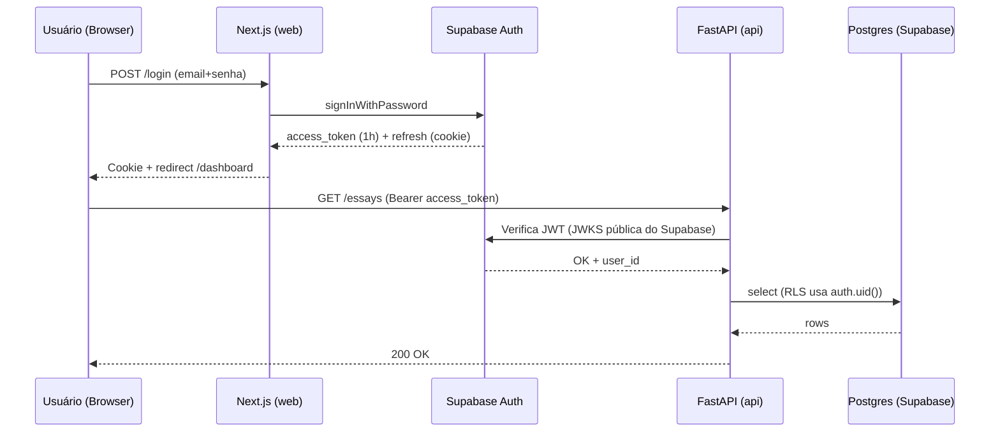

# Autenticação e autorização

> Seção original: PLAN.md §12. Fluxo de auth, middleware, RBAC (incl. role admin v2.0).

---

## 12.1 Fluxo de auth

- **Supabase Auth com PKCE** (recomendado para SSR)
- **Email + Senha** (mín 8 chars)
- **Google OAuth provider**
- Magic link opcional (pós-MVP)
- **JWT de acesso (1h)** + **refresh token (httpOnly cookie)**

### Diagrama



---

## 12.2 Middleware Next.js (web)

- `/(dashboard)/*` requer sessão → redirect `/login` se não autenticado
- `/(auth)/*` redireciona para `/dashboard` se já logado
- `/admin/*` requer `role='admin'` caso contrário redirect `/dashboard` (403 se preferir)
- **Server Components** garantem fluxo Next.js puro sem chamar API para auth

```ts
// apps/web/middleware.ts (esquema)
export async function middleware(req: NextRequest) {
  const res = NextResponse.next();
  const session = await getSession(req, res);
  const path = req.nextUrl.pathname;

  const isAuthRoute = path.startsWith('/login') ||
                      path.startsWith('/signup') ||
                      path.startsWith('/recuperar') ||
                      path.startsWith('/redefinir');

  const isAdminRoute = path.startsWith('/admin');

  // auth routes: redirect away if logged in
  if (isAuthRoute && session) {
    return NextResponse.redirect(new URL('/dashboard', req.url));
  }

  // protected
  if (!isAuthRoute && !session && (path.startsWith('/dashboard') || isAdminRoute)) {
    return NextResponse.redirect(new URL('/login', req.url));
  }

  // admin gone
  if (isAdminRoute && session?.role !== 'admin') {
    return NextResponse.redirect(new URL('/dashboard', req.url));
  }

  return res;
}
```

O `session.role` é preenchido a partir de uma consulta no `users` (ou via custom claim Supabase — ver #Decisões pendentes).

---

## 12.3 Autorização na API FastAPI

### Dependencies

- `get_current_user`: valida JWT Supabase (JWKS), injeta `user_id`, `role`, `status`
- `get_current_admin`: requer `role = 'admin'` e `status = 'active'`; caso contrário `403 forbidden`
- RLS no Postgres é a segunda camada de defesa

```python
# apps/api/app/dependencies.py
async def get_current_user(token: str = Depends(oauth2_scheme), db: AsyncSession = Depends(get_db)) -> User:
    payload = await verify_supabase_jwt(token)
    user = await db.get(User, payload["sub"])
    if user is None:
        raise HTTPException(401, "user not found")
    if user.status in ("suspended", "banned"):
        raise HTTPException(403, f"account {user.status}")
    return user

async def get_current_admin(user: User = Depends(get_current_user)) -> User:
    if user.role != "admin":
        raise HTTPException(403, "admin role required")
    return user
```

### Audit decorator

Toda rota admin que muta dados precisa logar em `admin_audit_log`:

```python
# apps/api/app/admin/audit.py
def audit_action(action: str, target_type: str):
    def deco(fn):
        @wraps(fn)
        async def wrapper(*args, admin: User = Depends(get_current_admin), request: Request, **kw):
            result = await fn(*args, admin=admin, request=request, **kw)
            await log_audit(db, request, admin, action, target_type, kw, result)
            return result
        return wrapper
    return deco

# Uso:
@router.post("/users/{user_id}/ban")
@audit_action("user.ban", "user")
async def ban_user(user_id: UUID, body: BanSchema, admin: User = Depends(get_current_admin)):
    ...
```

O `log_audit` persiste `admin_id`, `action`, `target_id`, `payload` (diff antes/depois), `ip_address`, `user_agent`.

---

## RBAC (v2.0)

### Roles

| Role | Permissões |
|---|---|
| `user` | Operações sobre próprios dados (essays, corrections, subscription, account). |
| `admin` | Todas as anteriores + tudo em `/admin/*`. |

### Gates

| Recurso | Quem pode |
|---|---|
| `GET /essays` | User dono OU admin |
| `GET /essays/{id}` | User dono OU admin |
| `DELETE /essays/{id}` | Apenas user dono |
| `PUT /admin/corrections/{essay_id}` | Apenas admin |
| `POST /admin/users/{id}/ban` | Apenas admin |
| `POST /admin/subscriptions/{id}/refund` | Apenas admin |

### Promover primeiro admin

Não há rota de self-promotion. Para criar o primeiro admin, executar manualmente via SQL Editor do Supabase:

```sql
update users set role = 'admin' where email = 'admin@redana.com.br';
```

Em staging/dev o `seed.sql` já cria o admin inicial.

---

## Decisões pendentes (confirmação do usuário)

| Questão | Opções |
|---|---|
| Como propagar `role` para a sessão Next.js | (a) Consultar `users` em `getSession()` (extra query) **(atual)**<br/>(b) Custom claim Supabase via trigger `on_auth_user_created` + JWT refresh |
| Login admin separado (`/admin/login`) | Recomendado por segurança (escopo de cookie menor). Confirmar. |
| Impersonation expiry | Proposta: 15 min, token rotulado `impersonating:true`, audit log por chamada de admin que tocou via impersonation. |

---

## Logout

- `POST /auth/logout` invoca Supabase `signOut` e invalida refresh cookie no browser.
- Admin actions pós-logout: o JWT access ainda pode ser válido até 1h (cache de JWKS), mas a session web está limpa e RLS não deixa consultar.