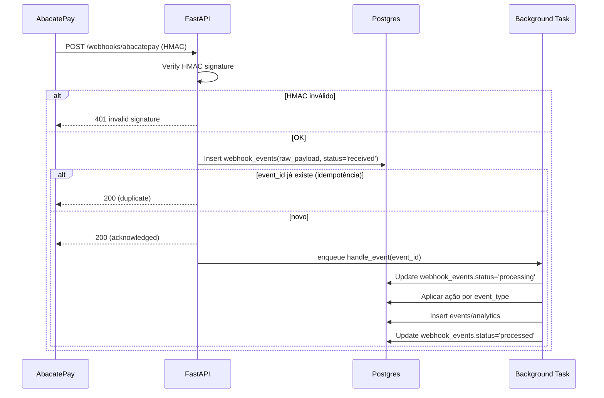

# Webhooks AbacatePay (handler detalhado)

> Seção original: PLAN.md §11.3. Documento deep-dive do handler `/webhooks/abacatepay`, incluindo segurança, idempotência e logs.

---

## Endpoint

`POST /api/v1/webhooks/abacatepay`

- **Público** (sem auth)
- Verificação de assinatura HMAC obrigatória
- Rate limitado (30 req/min por IP)
- Responder `200 OK` o mais rápido possível (após persistir raw payload em `webhook_events`); processar de forma assíncrona

---

## Fluxo



---

## Verificação HMAC

```python
# apps/api/app/utils/webhook_signature.py
import hmac, hashlib, base64

def verify_abacatepay_signature(raw_body: bytes, signature: str, secret: str) -> bool:
    expected = base64.b64encode(
        hmac.new(secret.encode(), raw_body, hashlib.sha256).digest()
    ).decode()
    return hmac.compare_digest(expected, signature)

# router
@router.post("/webhooks/abacatepay")
async def webhook(
    request: Request,
    x_abacatepay_signature: str = Header(...),
    raw: bytes = Depends(get_raw_body),
):
    if not verify_abacatepay_signature(raw, x_abacatepay_signature, settings.ABACATE_WEBHOOK_SECRET):
        raise HTTPException(401, "invalid signature")

    payload = json.loads(raw)
    event_id = payload.get("id") or payload.get("event_id")
    # ...idempotency check, persist, enqueue
```

> O body precisa ser lido em **raw** (bytes) antes de qualquer parsing — não use `Body(...)` direto no FastAPI sem `Request.body()`.

---

## Eventos tratados

| Evento | Ação |
|---|---|
| `subscription.completed` | Ativa plano, define `max_corrections`, `period_start/end`, atualiza `abacate_subscription_id` |
| `subscription.renewed` | Renova período (`period_end` += 1 ciclo); resetar `corrections_used = 0` |
| `subscription.cancelled` | `status = 'canceled'`, mantém ativos até `period_end`; depois free |
| `subscription.refunded` | Downgrade imediato para free + status='canceled' |
| `checkout.completed` (ONE_TIME fallback) | Marca pagamento avulso (se usarmos trimestral via checkout avulso) |

### Handler por event (resumo)

```python
TODO_MAP = {
    "subscription.completed": handle_subscription_completed,
    "subscription.renewed":  handle_subscription_renewed,
    "subscription.cancelled": handle_subscription_cancelled,
    "subscription.refunded":  handle_subscription_refunded,
    "checkout.completed":    handle_checkout_completed,
}

async def handle_event(event_id: UUID, event_type: str, payload: dict):
    handler = TODO_MAP.get(event_type)
    if not handler:
        await mark_event_unknown(event_id)
        return
    try:
        await handler(payload)
        await mark_event_processed(event_id)
    except Exception as e:
        await mark_event_failed(event_id, str(e))
        # Sentry alert
```

---

## Idempotência

- `webhook_events.abacate_event_id` é UNIQUE
- Antes de enfileirar o handler, faz `INSERT ... ON CONFLICT DO NOTHING` e verifica se rows afetadas = 0 → se 0, já processado antes → return 200 (duplicate)
- Handlers internos devem ser **idempotentes**:
  - `subscription.renewed`: `UPDATE subscriptions SET corrections_used = 0 ... WHERE period_end < now()` evita dupla renovação
  - `subscription.completed`: `INSERT ... ON CONFLICT (user_id) DO UPDATE`, com audit comparando estado anterior

---

## Reconciliação diária

Como webhook pode se perder:

- **Job diário** (cron/FastAPI `lifespan` task): chama `GET /subscriptions` no AbacatePay para usuários com `abacate_subscription_id` não-null e sincroniza status `active`/`past_due`/`canceled`.
- Se discrepância, logar em `webhook_events` com `event_type='reconciliation.drift'` + admin pode ver em [admin/payments-and-webhooks.md](../../admin/payments-and-webhooks.md).

---

## Testes

- **Test unitário** do HMAC verify: vetor fixo de inputs/expected.
- **Test integration** do handler: mock AbacatePay payload → DB assertions por event_type.
- **Test idempotência**: replay mesmo evento → segundo `200 OK` sem mudança de estado.

```python
def test_hmac_invalid():
    resp = client.post("/webhooks/abacatepay", headers={"x-abacatepay-signature": "wrong"}, json={})
    assert resp.status_code == 401

def test_subscription_renewed_resets_usage(db, mock_abacate_payload):
    create_subscription(... corrections_used=30, period_end=past)
    handle_subscription_renewed(mock_abacate_payload)
    sub = get_subscription(...)
    assert sub.corrections_used == 0
    assert sub.period_end > now()
```

---

## Variáveis de ambiente

Ver [payments-abacatepay.md](../features/payments-abacatepay.md) §11.4.

- `ABACATE_WEBHOOK_SECRET` — usado pelo HMAC
- `ABACATE_API_KEY` — usado para reconciliação (não para webhook)