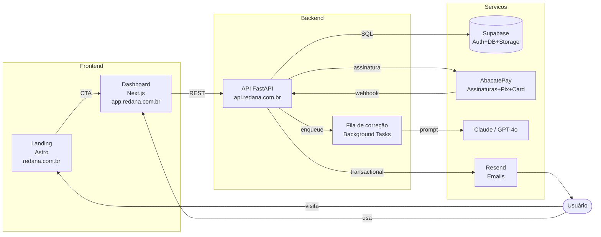
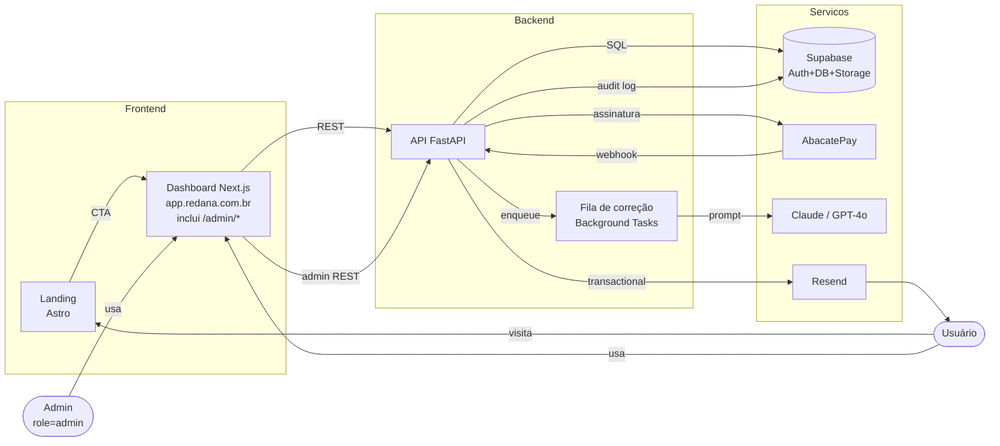

# Diagrama do sistema e responsabilidades

> Seção original: PLAN.md §4 (4.1 diagrama + 4.2 responsabilidades).

---

## 4.1 Diagrama do sistema

### Diagrama estendido (com Admin Panel — v2.0)

> **Decisão pendente (confirmação do usuário):** o admin live como rotas `/admin/*` dentro do mesmo app Next.js (`apps/web`), **ou** em app dedicado `apps/admin`. Documentação atual assume rota dentro do `apps/web` por simplicidade. Ver [admin/overview.md](../../admin/overview.md) § "Onde o admin vive".

---

## 4.2 Responsabilidade de cada app

| App | Função |
|---|---|
| `apps/landing` (Astro) | Marketing estático. Botões CTA → `app.redana.com.br/signup`. Ver [landing.md](../frontend/landing.md). |
| `apps/web` (Next.js 14) | Dashboard do aluno: auth, envio, visualização de correções, planos. **Inclui rotas `/admin/*`** do painel admin. Ver [dashboard-routes.md](../frontend/dashboard-routes.md). |
| `apps/api` (FastAPI) | Toda lógica: auth JWT verify, essays, corrections, subscriptions, abacatepay webhooks, **+ routers admin (`/admin/*`)**. Ver [contracts.md](../api/contracts.md). |
| `packages/shared` | Tipos TS, constantes (competências, planos), design tokens. |
| `packages/db` | `schema.sql`, migrações Supabase, seed. Ver [schema.md](../data/schema.md). |
| `packages/email` | Templates React Email (welcome, correção-pronta, etc). Ver [emails.md](../features/emails.md). |

---

## Fronteiras e responsabilidades transversais

| Responsabilidade | Dono | Detalhe |
|---|---|---|
| Auth (JWT verify) | FastAPI (via Supabase JWKS) | Web repassa JWT; API valida. RLS é backup. |
| RLS no DB | Supabase / `packages/db` | Toda tabela com `user_id` tem RLS. |
| Rate limiting | FastAPI (slowapi) | [rate-limiting.md](../api/rate-limiting.md). |
| Webhook HMAC verify | FastAPI | [webhooks-abacatepay.md](../api/webhooks-abacatepay.md). |
| Enfileiramento de correção | FastAPI BackgroundTasks | Migração para Celery+Redis é pós-MVP. |
| Audit log de admin | FastAPI + Postgres | Tabela `admin_audit_log`. Ver [admin/overview.md](../../admin/overview.md). |