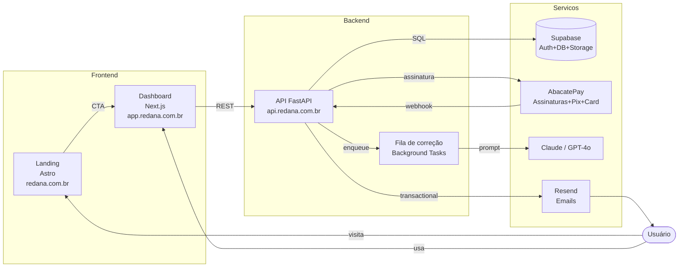

# Redana — Plano do Sistema (v1.1)

> **SaaS de correção de redação do ENEM** — versão revisada e aprimorada com integração AbacatePay.
>
> **Versão:** 1.1 — Revisão técnica
> **Data:** Julho de 2026
> **Produto:** Redana (anteriormente NotaCerta)
> **Landing no ar:** https://redana-alexsander532s-projects.vercel.app
> **GitHub:** https://github.com/Alexsander532/redana
> **Base do projeto (monorepo):** `C:\Users\Alexsander\Desktop\redana`

---

## 1. Visão geral e objetivos

### O que é

Redana é uma plataforma brasileira onde estudantes enviam suas redações do ENEM e recebem, em minutos, uma correção detalhada organizada pelas **5 competências oficiais** (C1 a C5): nota estimada por competência, feedback qualitativo e um plano de melhoria para a próxima redação.

### Metas do produto (MVP)

- Recém-cadastrado consiga corrigir sua primeira redação em menos de 5 minutos
- Free tier com 5 correções vitalícias (sem cartão) — prova de valor antes da venda
- Planos pagos recorrentes: Mensal R$ 9,90, Trimestral R$ 25,20 (15% off), Anual R$ 82,80 (30% off)
- Dashboard de evolução por competência ao longo das redações
- Margem saudável mesmo no plano Anual: custo por correção abaixo do preço por mês dividido por uso médio

### Fora do escopo (MVP)

- Correção humana (admin panel) → **Fase 5**
- MercadoPago/Pix avulso além do que AbacatePay oferece → **Fase 6**
- App mobile nativo, PWA offline, suporte a PDF/OCR de redações manuscritas → **Pós-MVP**
- Tema/tema-roteiro automático da redação (detecção do tema) → **Aberto**

---

## 2. Premissas

| Premissa | Razão |
|---|---|
| **Monorepo com Turborepo + pnpm** | Landing + Dashboard + API compartilham tipos, design tokens e catálogo de planos. Evita drift entre apps. |
| **Subdomínios** | `redana.com.br` (landing), `app.redana.com.br` (dashboard), `api.redana.com.br` (FastAPI). Separa cache/CDN, SEO e preocupações de deploy. |
| **Landing em Astro (existente)** | Já no ar, nota alta em performance. Mantém no monorepo como `apps/landing`. |
| **Dashboard em Next.js 14 (App Router)** | SSR + RSC para busca de dados, middleware de auth, deploy no Vercel, ecossistema React. |
| **API em Python FastAPI** | Orquestração de LLM, prompts estruturados, ML libs — Python é o padrão para IA/LLM. |
| **Supabase Auth + Postgres** | Tudo-em-um gerenciado: auth (email + Google), DB, RLS, Storage, Real-time. Free tier generoso. |
| **LLM principal: Anthropic Claude (3.5 Sonnet+)** | Excelente em seguir rubrica estruturada, contexto longo, saída JSON. |
| **LLM fallback: OpenAI GPT-4o** | Redundância, disponibilidade. |
| **Pagamentos AbacatePay** | Gateway brasileiro, suporta Assinaturas (Mensal/Anual), Cartão e PIX. Webhooks HMAC. Mais simples que Stripe/MercadoPago para cobrança recorrente BR. |
| **Sem “unlimited” ilimitado** | Planos pagos têm limite de correções por ciclo (ex.: 30/mês) para controlar custo de LLM — comunicado como “até 30 correções/mês”. |
| **Política de retenção:** Escrito da redação mantido 12 meses, depois anonimizado (LGPD) | Compliance sem inchar DB. |

---

## 3. Escopo do MVP (in/out)

### ✅ Dentro do MVP

1. Cadastro/login (email + Google OAuth via Supabase)
2. Envio de redação por texto colado OU upload `.txt`/`.docx`
3. Correção por IA: notas C1-C5, nota geral, feedback por competência, plano de próximos passos
4. Dashboard: histórico de redações, gráfico de evolução, barra de uso (Free)
5. Asinaturas via AbacatePay (Mensal, Trimestral, Anual) — chega de Free é só upgrade manual
6. Webhook AbacatePay para sincronizar status de assinatura
7. Cancelamento pelo usuário via portal/botão → downgrade para Free ao fim do ciclo
8. Emails transacionais (Resend): welcome, redação corrigida, redefinição de senha
9. LGPD básico: política, exportar meus dados, excluir conta
10. Responsivo 320px–1440px

### ❌ Fora do MVP

- Painel admin + correção humana
- MercadoPago paralelo
- Upload de PDF com OCR
- PWA offline
- Tema-deteccão
- Notificações push
- Programmatic SEO (camadas/cm campanhas)

---

## 4. Arquitetura

### 4.1 Diagrama do sistema



### 4.2Responsabilidade de cada app

| App | Fut| Função |
|---|---|---|
| `apps/landing` (Astro) | Marketing estático. Botões CTs A→ `app.redana.com.br/signup` |
| `apps/web` (Next.js 14) | Dashboard do aluno: auth, envio, visualização de correções, planos. |
| `apps/api` (FastAPI) | Toda lógica: auth JWT verify, essays, corrections, subscriptions, abacatepay webhooks. |
| `packages/shared` | Tipos TS, constantes (competências, planos), design tokens. |
| `packages/db` | `schema.sql`, migrações Supabase, seed. |
| `packages/email` | Templates React Email (welcome, correção-pronta, etc). |

---

## 5. Estrutura do monorepo (árvore completa)

```
C:\Users\Alexsander\Desktop\redana\
├── apps/
│   ├── landing/                      # Astro — marketing (migrado do projeto notacerta)
│   │   ├── src/
│   │   │   ├── pages/index.astro
│   │   │   ├── layouts/BaseLayout.astro
│   │   │   ├── components/
│   │   │   │   └── TestimonialCarousel.astro
│   │   │   └── styles/global.css
│   │   ├── public/
│   │   │   ├── favicon.svg
│   │   │   ├── robots.txt
│   │   │   ├── sitemap.xml
│   │   │   └── llms.txt
│   │   ├── astro.config.mjs
│   │   └── package.json
│   │
│   ├── web/                          # Next.js 14 — Dashboard do aluno
│   │   ├── src/
│   │   │   ├── app/
│   │   │   │   ├── layout.tsx                # Root (fonts, ThemeProvider)
│   │   │   │   ├── page.tsx                  # Redireciona /login ou /dashboard
│   │   │   │   ├── (auth)/
│   │   │   │   │   ├── layout.tsx
│   │   │   │   │   ├── login/page.tsx
│   │   │   │   │   ├── signup/page.tsx
│   │   │   │   │   ├── recuperar/page.tsx
│   │   │   │   │   └── redefinir/page.tsx
│   │   │   │   └── (dashboard)/
│   │   │   │       ├── layout.tsx            # Shell com sidebar
│   │   │   │       ├── page.tsx              # Home: evolução + últimas redações
│   │   │   │       ├── nova-redacao/page.tsx
│   │   │   │       ├── redacoes/
│   │   │   │       │   └── [id]/page.tsx    # Resultado da correção
│   │   │   │       ├── planos/page.tsx
│   │   │   │       ├── conta/page.tsx
│   │   │   │       └── suporte/page.tsx
│   │   │   ├── components/
│   │   │   │   ├── ui/                       # Button, Card, Input, Modal, ...
│   │   │   │   ├── auth/
│   │   │   │   │   ├── LoginForm.tsx
│   │   │   │   │   ├── SignupForm.tsx
│   │   │   │   │   └── GoogleButton.tsx
│   │   │   │   ├── redacao/
│   │   │   │   │   ├── EssayForm.tsx          # Texto + upload .txt/.docx
│   │   │   │   │   ├── FreeTierCounter.tsx
│   │   │   │   │   └── SubmissionProgress.tsx # SSE/polling
│   │   │   │   ├── correcao/
│   │   │   │   │   ├── ScoreHeader.tsx
│   │   │   │   │   ├── CompetencyBars.tsx     # C1-C5 com barras (igual landing)
│   │   │   │   │   ├── CompetencyFeedback.tsx
│   │   │   │   │   ├── NextSteps.tsx
│   │   │   │   │   └── OverallScoreBadge.tsx
│   │   │   │   ├── dashboard/
│   │   │   │   │   ├── EvolutionChart.tsx    # Recharts
│   │   │   │   │   ├── EssayHistory.tsx
│   │   │   │   │   ├── EssayRow.tsx
│   │   │   │   │   ├── PlanStatusCard.tsx
│   │   │   │   │   └── UpgradeBanner.tsx
│   │   │   │   ├── planos/
│   │   │   │   │   ├── PricingCards.tsx       # Reusa styles da landing
│   │   │   │   │   └── CurrentPlanBadge.tsx
│   │   │   │   └── layout/
│   │   │   │       ├── Sidebar.tsx
│   │   │   │       ├── Topbar.tsx
│   │   │   │       └── UserMenu.tsx
│   │   │   ├── lib/
│   │   │   │   ├── supabase/
│   │   │   │   │   ├── client.ts             # Browser
│   │   │   │   │   ├── server.ts             # Server (cookies)
│   │   │   │   │   └── middleware.ts
│   │   │   │   ├── api.ts                    # fetch wrapper
│   │   │   │   ├── abacatepay.ts             # Helpers de checkout
│   │   │   │   └── utils.ts
│   │   │   ├── hooks/
│   │   │   │   ├── useAuth.ts
│   │   │   │   ├── useEssays.ts
│   │   │   │   └── useSubscription.ts
│   │   │   └── styles/globals.css
│   │   ├── middleware.ts                     # Auth redirects
│   │   ├── next.config.js
│   │   ├── tailwind.config.ts
│   │   ├── tsconfig.json
│   │   └── package.json
│   │
│   └── api/                          # FastAPI — backend
│       ├── app/
│       │   ├── main.py                       # App FastAPI + routers
│       │   ├── config.py                     # Settings (pydantic-settings)
│       │   ├── database.py                   # Async SQLAlchemy
│       │   ├── dependencies.py
│       │   ├── models/
│       │   │   ├── user.py
│       │   │   ├── essay.py
│       │   │   ├── correction.py
│       │   │   └── subscription.py
│       │   ├── schemas/
│       │   │   ├── auth.py
│       │   │   ├── essay.py
│       │   │   ├── correction.py
│       │   │   └── subscription.py
│       │   ├── routers/
│       │   │   ├── auth.py                   # /auth/*
│       │   │   ├── essays.py                 # /essays/*
│       │   │   ├── corrections.py            # /corrections/*
│       │   │   ├── subscriptions.py          # /subscriptions/*
│       │   │   ├── webhooks_abacatepay.py     # /webhooks/abacatepay
│       │   │   └── account.py                # /account/* (LGPD: export/delete)
│       │   ├── services/
│       │   │   ├── correction_engine.py      # Orquestra LLM
│       │   │   ├── prompt_templates.py       # Prompts ENEM C1-C5
│       │   │   ├── abacatepay_service.py     # Cliente AbacatePay
│       │   │   ├── subscription_service.py   # Estado da assinatura
│       │   │   ├── rate_limiter.py           # Free tier / paid caps
│       │   │   ├── email_service.py          # Resend
│       │   │   └── text_parser.py            # .txt/.docx extraction
│       │   └── utils/
│       │       ├── enem_scoring.py           # Validação de scores
│       │       └── webhook_signature.py      # HMAC AbacatePay
│       ├── alembic/
│       │   ├── env.py
│       │   └── versions/
│       ├── tests/
│       ├── Dockerfile
│       ├── requirements.txt
│       ├── pyproject.toml
│       └── .env.example
│
├── packages/
│   ├── shared/
│   │   ├── src/
│   │   │   ├── types/            # essay, correction, user, subscription
│   │   │   ├── constants/        # competencies.ts, plans.ts
│   │   │   └── tokens.ts        # Design tokens (cores do Redana)
│   │   ├── tsconfig.json
│   │   └── package.json
│   ├── db/
│   │   ├── schema.sql
│   │   ├── seed.sql
│   │   └── migrations/
│   └── email/
│       ├── templates/
│       │   ├── welcome.tsx
│       │   ├── reset-password.tsx
│       │   ├── correction-ready.tsx
│       │   └── upgrade-reminder.tsx
│       └── package.json
│
├── .github/
│   └── workflows/
│       └── ci.yml                # lint + test api/web em paralelo
├── .env.example
├── .gitignore
├── package.json                  # Raiz — workspaces pnpm
├── pnpm-workspace.yaml
├── turbo.json
└── PLAN.md                       # Este documento
```

---

## 6. Stack e decisões técnicas

| Camada | Tecnologia | Por quê |
|---|---|---|
| Landing | Astro 5 | Já em produção, zero-JS, Lighthouse 95+. |
| Dashboard | Next.js 14 (App Router) | SSR/RSC, middleware auth, deploy Vercel nativo. |
| Estilos | Tailwind CSS v4 + design tokens (`packages/shared`) | Utility-first, alinha chips visualmente com a landing. |
| API | Python FastAPI 0.110+ | Async, Pydantic v2, OpenAPI automático. |
| ORM | SQLAlchemy 2.0 (async) + Alembic | ORM maduro, migrations versionadas. |
| Auth | Supabase Auth (PKCE) | Email + Google, JWT, RLS. |
| DB | Supabase PostgreSQL | Postgres gerenciado, RLS, real-time, Storage. |
| LLM | Anthropic Claude 3.5 Sonnet (primário) + GPT-4o (fallback) | Rubrica estruturada em PT-BR. |
| **Pagamentos** | **AbacatePay** | Gateway brasileiro, assinaturas (cycle MONTHLY/ANNUALLY), PIX + Cartão, webhooks HMAC, valores em centavos BRL. |
| Email | Resend + React Email | Templates em React, entrega rápida. |
| Monorepo | Turborepo + pnpm | Builds paralelos, cache, workspaces. |
| Deploy Front | Vercel | Front já lá; Next.js nativo. |
| Deploy API | Railway | Dockerfile simples, persistência opcional. |
| Observabilidade | Logflare (Supabase) + Sentry | Logs + erros. |

### Por que AbacatePay ao invés de Stripe

- **Foco em Brasil**: PIX + Cartão + Boleto nativos. Sem taxa de cross-border.
- **Assinaturas via produto com `cycle`**: `MONTHLY` e `ANNUALLY` suportados. Trimestral pode ser cobrado como três checkouts `ONE_TIME` ou um produto avulso. Ver seção 12.3.
- **Transparent Checkout opcional**: Embutido PIX no app (gera `brCode` + QR PNG na hora).
- **Webhooks HMAC**: Verificação de assinatura confiável.
- **SDKs**: Oficial para Node.js e Python → integra direto no backend.

### Limitações conhecidas da AbacatePay

| Limitação | Impacto | Mitigação |
|---|---|---|
| **Sem `SEMIANNUALLY` para trimestral** — só WEEKLY/MONTHLY/SEMIANNUALLY/ANNUALLY | Trimestral não encaixa direto | Trimestral = 3 cobranças `ONE_TIME` agendadas OU criar um produto `quarterly` com `cycle: ONE_TIME` e um job que recria. **Decisão:** Trimestral vira checkout recorrente com `cycle: MONTHLY` + cupom/metadata `plan=quarterly` controlado no DB. |
| **Sem Customer Portal pronto** | Usuário não auto-gerencia cartão | Implementar tela “Meu plano” no dashboard com botão Cancelar via API `POST /subscriptions/cancel`. Mudança de cartão → gerar novo checkout. |
| **Charge automatic retry?** | Falta clareza na doc | Monitorar webhook `subscription.cancelled` para degradar plano. Recuperação via email de “atualize seu cartão”. |
| **Reembolso só integral** | Sem partial refund | Política de reembolso: 7 dias para cancelar integral dentro do trial. |

---

## 7. Modelo de domínio e esquema do banco

### 7.1 Entidades principais

```mermaid
erDiagram
  users ||--|| subscriptions : "1:1"
  users ||--o{ essays : "1:N"
  essays ||--o| corrections : "1:1"
  users ||--o{ abacate_customers : "1:1 (opcional)"

  users {
    uuid id PK
    text email UNIQUE
    text name
    text avatar_url
    text auth_provider
    timestamptz created_at
  }
  subscriptions {
    uuid id PK
    uuid user_id FK
    text plan "free|monthly|quarterly|annual"
    text status "active|past_due|canceled|expired"
    text abacate_subscription_id
    int corrections_used
    int max_corrections "null = unlimited"
    timestamptz period_start
    timestamptz period_end
  }
  essays {
    uuid id PK
    uuid user_id FK
    text title
    text content
    int word_count
    text status "pending|processing|completed|failed"
    text source "text|file"
    timestamptz created_at
    timestamptz completed_at
  }
  corrections {
    uuid id PK
    uuid essay_id FK UNIQUE
    uuid user_id FK
    int overall_score "0-1000"
    int c1_score "0-200"
    int c2_score
    int c3_score
    int c4_score
    int c5_score
    text c1_feedback
    text c2_feedback
    text c3_feedback
    text c4_feedback
    text c5_feedback
    text overall_feedback
    jsonb next_steps
    text corrected_by "ai|human"
    text llm_model
    numeric llm_cost_brl
    timestamptz created_at
  }
```

### 7.2 SQL (resumo)

```sql
-- packages/db/schema.sql

create table users (
  id uuid primary key default gen_random_uuid(),
  email text unique not null,
  name text,
  avatar_url text,
  auth_provider text not null default 'email',
  created_at timestamptz default now(),
  updated_at timestamptz default now()
);

create table subscriptions (
  id uuid primary key default gen_random_uuid(),
  user_id uuid not null references users(id) on delete cascade,
  plan text not null default 'free' check (plan in ('free','monthly','quarterly','annual')),
  status text not null default 'active' check (status in ('active','past_due','canceled','expired')),
  abacate_subscription_id text,
  abacate_customer_id text,
  corrections_used int not null default 0,
  max_corrections int,  -- null = unlimited
  period_start timestamptz,
  period_end timestamptz,
  created_at timestamptz default now(),
  updated_at timestamptz default now()
);

create table essays (
  id uuid primary key default gen_random_uuid(),
  user_id uuid not null references users(id) on delete cascade,
  title text,
  content text not null,
  word_count int not null,
  status text not null default 'pending' check (status in ('pending','processing','completed','failed')),
  source text check (source in ('text','file')),
  file_url text,
  created_at timestamptz default now(),
  completed_at timestamptz
);

create table corrections (
  id uuid primary key default gen_random_uuid(),
  essay_id uuid not null references essays(id) on delete cascade,
  user_id uuid not null references users(id) on delete cascade,
  overall_score int not null check (overall_score between 0 and 1000),
  c1_score int not null check (c1_score between 0 and 200),
  c2_score int not null check (c2_score between 0 and 200),
  c3_score int not null check (c3_score between 0 and 200),
  c4_score int not null check (c4_score between 0 and 200),
  c5_score int not null check (c5_score between 0 and 200),
  c1_feedback text, c2_feedback text, c3_feedback text, c4_feedback text, c5_feedback text,
  overall_feedback text,
  next_steps jsonb,
  corrected_by text not null default 'ai',
  llm_model text,
  llm_cost_brl numeric(10,4),
  created_at timestamptz default now()
);

-- RLS:
alter table essays enable row level security;
create policy "user_sees_own_essays" on essays for select using (auth.uid() = user_id);
create policy "user_inserts_own_essays" on essays for insert with check (auth.uid() = user_id);

alter table corrections enable row level security;
create policy "user_reads_own_corrections" on corrections for select using (auth.uid() = user_id);

alter table subscriptions enable row level security;
create policy "user_reads_own_sub" on subscriptions for select using (auth.uid() = user_id);

-- Indexes
create index idx_essays_user_created on essays (user_id, created_at desc);
create index idx_corrections_essay on corrections (essay_id);
create index idx_subscriptions_user on subscriptions (user_id);
```

### 7.3Invari

- `corrections.overall_score = c1+c2+c3+c4+c5` (validado server-side)
- `subscriptions.corrections_used <= max_corrections` (ou `max_corrections` é `null`)
- Free tier: `max_corrections = 5`, **vitalício** (não reseta)
- Planos pagos: `max_corrections = 30` por ciclo (não “unlimited”; documenta como “até 30/mês”)
- `essays.status` só vai `completed` quando há `corrections` row vinculada

---

## 8. Contratos de API (rotas principais)

Base: `https://api.redana.com.br/api/v1`

### Auth (Supabase client + API verify)

| Método | Rota | Descrição |
|---|---|---|
| POST | `/auth/signup` | Cria user no Supabase + cria `subscriptions` default free |
| POST | `/auth/login` | Login via Supabase, retorna JWT |
| POST | `/auth/logout` | Refresh token invalidate |
| GET | `/auth/me` | Perfil + subscription summary |

### Essays

| Método | Rota | Descrição |
|---|---|---|
| GET | `/essays?limit=20&offset=0` | Lista paginada (dono) |
| POST | `/essays` | Cria redação → dispara correção async |
| GET | `/essays/{id}` | Redação + correction (se houver) |
| DELETE | `/essays/{id}` | Soft delete |
| GET | `/essays/{id}/status` | SSE/streaming de progresso (opcional) |

### Corrections

| Método | Rota | Descrição |
|---|---|---|
| GET | `/corrections/{essay_id}` | Detalhe da correção |
| POST | `/corrections/{essay_id}/retry` | Refaz IA (reseta `corrections_used`? Não) |

### Subscriptions

| Método | Rota | Descrição |
|---|---|---|
| GET | `/subscriptions/me` | Estado atual: plano, status, usado/restante |
| POST | `/subscriptions/checkout` | Cria checkout AbacatePay → retorna URL |
| POST | `/subscriptions/cancel` | Cancela assinatura ativa |
| POST | `/subscriptions/change-plan` | Troca de plano (novo checkout) |

### Webhooks (público, com assinatura HMAC)

| Método | Rota | Descrição |
|---|---|---|
| POST | `/webhooks/abacatepay` | Notificações: subscription.completed, .renewed, .cancelled, checkout.completed |

### Account (LGPD)

| Método | Rota | Descrição |
|---|---|---|
| POST | `/account/export` | Gera JSON com todos os dados do usuário |
| POST | `/account/delete` | Agenda deleção (grace period 30 dias) |

---

## 9. Frontend — rotas e telas-chave

### Rotas Next.js (App Router)

```
/login                          → LoginForm (email + Google OAuth)
/signup                         → SignupForm
/recuperar                      → Solicitar reset
/redefinir                      → Nova senha (token query param)

/                               → redirect to /login ou /dashboard
/dashboard                      → Home: evolução + últimas redações + plano
/nova-redacao                   → EssayForm
/redacoes/[id]                  → Resultado da correção
/planos                         → PricingCards + upgrade
/conta                          → Perfil + plano + danger zone (LGPD)
/suporte                        → FAQ + contato
```

### Telas-chave

**Dashboard home** — Cards: plano atual + correções restantes, gráfico de evolução (Recharts), últimas 5 redações com preview de nota e status.

**Nova redação** — Editor de texto (min 150 palavras, max 1500), OU upload .txt/.docx. Botão “Corrigir agora” desabilitado se 0 restantes → UpgradeBanner.

**Resultado** — ScoreHeader (0-1000 badged), CompetencyBars C1-C5 (mesmo design da landing), feedback textual por competência (accordion), NextSteps (cards), compartilhar/baixar PDF (pós-MVP).

**Planos** — Reaproveita PricingCards da landing. Clique → `POST /subscriptions/checkout` → redirect AbacatePay → retorno `returnUrl`.

**Conta** — Avatar, nome, email (read-only, Supabase), status da assinatura, botão cancelar, exportar dados (LGPD), excluir conta.

---

## 10. Engine de correção (design detalhado)

### 10.1 Fluxo

```
1. POST /essays com content
2. Rate limiter verifica subscription.corrections_used < max_corrections
3. Incrementa corrections_used + cria essay status=pending
4. Enfileira job (FastAPI BackgroundTasks; migrar a Celery+Redis depois)
5. CorrectionEngine.process(essay_id):
   a. Monta prompt com texto + rubrica ENEM
   b. Chama Claude (fallback GPT-4o) com tool/function para JSON estruturado
   c. Parse + valida scores (0-200 por competência, soma = overall)
   d. Se inválido → retry 1x com “/json-fix” injetado
   e. Persiste correction + essay.status=completed
   f. Envia email “correção pronta”
```

### 10.2 Schema de saída do LLM (JSON)

```json
{
  "overall_score": 880,
  "competencies": {
    "c1": { "score": 160, "feedback": "..." },
    "c2": { "score": 200, "feedback": "..." },
    "c3": { "score": 160, "feedback": "..." },
    "c4": { "score": 200, "feedback": "..." },
    "c5": { "score": 160, "feedback": "..." }
  },
  "overall_feedback": "Resumo exec...",
  "next_steps": [
    { "area": "c5", "action": "Detalhar agente, ação, meio e finalidade", "priority": "alta" }
  ]
}
```

### 10.3 Estratégia de prompt (resumo)

- **System**: “Você é um corretor oficial do ENEM. Use a rubrica atual do INEP.”
- **User**: rubrica resumida C1-C5 + texto da redação
- **Mode**: `tool` para forçar JSON válido (Claude) ou `response_format: json_schema` (GPT-4o)
- **Idioma**: 100% PT-BR nas saídas
- **Antialucinação**: exigir 3 citações do texto do aluno por feedback de competência

### 10.4 Controle de custo LLM

- Cache de prompts da rubrica (fixo) — só texto da redação é dinâmico
- Limite de 30 correções/mês nos planos pagos (não “unlimited”)
- Estimativa de custo: ~R$0,03 por correção (Claude Sonnet entrada+saida~2k tokens)
- Dashboard de custo no admin (pós-MVP)

### 10.5 UX de latência

- Frontend mostra “Analisando...” com skeleton de CompetencyBars
- Polling `/essays/{id}/status` a cada 3s OU SSE via `/essays/{id}/stream`
- Tempo médio: 20-40s → mostrar progresso com tâmpano estimado

---

## 11. Integração AbacatePay

### 11.1 Setup inicial

1. Criar conta AbacatePay → obter `ABACATE_API_KEY` + `ABACATE_WEBHOOK_SECRET`
2. Criar produtos via API ou painel:

| Produto | externalId | cycle | price (centavos) |
|---|---|---|---|
| Plano Mensal | `plan_monthly` | `MONTHLY` | 990 |
| Plano Anual | `plan_annual` | `ANNUALLY` | 8280 |

3. Trimestral: criado como produto `plan_quarterly` com `cycle: MONTHLY` e `price: 840`; no DB marcamos `plan = 'quarterly'` e `period_end = now() + 3 months`. **Solução mais limpa sem arremedo.**
4 Registrar webhook: `POST /webhooks/create` com endpoint `https://api.redana.com.br/api/v1/webhooks/abacatepay` e eventos: `subscription.completed, subscription.renewed, subscription.cancelled, checkout.completed`

### 11.2 Fluxo de upgrade (Free → Pago)

```
Usuário clica "Assinar Anual" no dashboard
↓
POST /subscriptions/checkout { plan: 'annual' }
↓
API cria checkout AbacatePay: POST /checkouts/create
  items: [{ id: product_annual.id, quantity: 1 }]
  frequency: SUBSCRIPTION
  returnUrl: https://app.redana.com.br/planos?status=success
  completionUrl: https://app.redana.com.br/dashboard
↓
Retorna { url } → frontend redirect
↓
Cliente paga no checkout AbacatePay (Cartão ou PIX)
↓
AbacatePay dispara webhook subscription.completed
↓
API: valida HMAC, encontra user, atualiza subscriptions:
  plan = 'annual', status = 'active',
  abacate_subscription_id = <id>,
  max_corrections = 30,
  period_start = now, period_end = now + 365d
↓
Envia email “Assinatura ativa” (Resend)
```

### 11.3 Fluxos webhook (handlers)

| Evento | Ação |
|---|---|
| `subscription.completed` | Ativa plano, define max_corrections, period_start/end |
| `subscription.renewed` | Renova período (`period_end` += 1 ciclo), resetar `corrections_used = 0` |
| `subscription.cancelled` | `status = 'canceled'`, mantém ativos até `period_end`; depois free |
| `checkout.completed` (ONE_TIME fallback) | Marca pagamento avulso (se usarmos trimestral via checkout avulso) |
| `subscription.refunded` | Downgrade imediato para free |

### 11.4 Variáveis de ambiente

```
ABACATE_API_KEY=abk_live_xxx
ABACATE_WEBHOOK_SECRET=whsec_xxx
ABACATE_PRODUCT_MONTHLY_ID=prod_xxx
ABACATE_PRODUCT_ANNUAL_ID=prod_xxx
ABACATE_PRODUCT_QUARTERLY_ID=prod_xxx
ABACATE_DEV_MODE=true  # sandbox
```

### 11.5 Tela “Meu plano” (substituto do portal)

Como AbacatePay não tem customer portal de auto-serviço, implementamos:

- Card de plano atual: nome, preço, próxima cobrança
- Botão **Cancelar assinatura** → `POST /subscriptions/cancel` → API chama AbacatePay `POST /subscriptions/cancel`
- Botão **Trocar plano** → abre modal com PricingCards → novo checkout
- Botão **Atualizar cartão** → instrutivo: “Cancele e reative com novo cartão” (limitação da AbacatePay)

---

## 12. Autenticação e autorização

### 12.1 Fluxo

- Supabase Auth com PKCE (recomendado para SSR)
- Email + Senha (mín 8 chars)
- Google OAuth provider
- Magic link opcional (pós-MVP)
- JWT de acesso (1h) + refresh token (httpOnly cookie)

### 12.2 Middleware Next.js

- `/(dashboard)/*` requer sessão → `/login` se não autenticado
- `/(auth)/*` redireciona para `/dashboard` se já logado
- Server Roles garantem fluxo Next.js puro sem necessidade de chamar API para auth

### 12.3 Autorização na API FastAPI

- Dependency `get_current_user`: valida JWT Supabase, injeta `user_id`
- RLS no Postgres é a segunda camada de defesa

---

## 13. Segurança & LGPD

### 13.1 Segurança

- **Secrets em env vars**, nunca em código. `.env.example` documenta todas as chaves.
- **CORS**: API permite só `app.redana.com.br` e `redana.com.br`.
- **Rate limiting**: FastAPI middleware (ex.: slowapi) — 60 req/min por IP, 5 essays/h por user.
- **Input validation**: Pydantic em todos endpoints; redação entre 150-1500 palavras.
- **Upload**: apenas `.txt` e `.docx`, máx 100KB. Antivírus escaneamento (pós-MVP).
- **HMAC webhook**: signature verification antes de processar evento AbacatePay.
- **RLS**: todas as tabelas com `user_id` têm RLS habilitado.

### 13.2 LGPD

- Base legal: **consentimento** do titular para tratar redação (finalidade: correção educacional).
- Política de Privacidade + Termos acessíveis no rodapé.
- **Retenção**: conteúdo da redação mantido por 12 meses; após isso, campo `content` é sobrescrito por hash anônimo (mantém notas/feedback para analytics).
- **Direitos do titular**:
  - Exportar dados: `POST /account/export` → JSON com essays, corrections, subscription.
  - Excluir conta: `POST /account/delete` → grace period 30 dias → hard delete (cascade).
  - Retificação: editar nome na tela Conta.
- Criptografia em repouso: Supabase (AES-256 gerenciado). Em trânsito: TLS 1.2+.
- DPO/encarregado: email de contato na política.

---

## 14. Observabilidade

| Sinal | Ferramenta | Onde |
|---|---|---|
| Erros de aplicação | Sentry | API + Web |
| Logs de runtime | Logflare (Supabase logs) | API |
| Métricas de negócio | Tabela `events` no DB | API insere |
| Up/Down | Better Stack (ping) | Endpoint `/health` |
| Custo LLM | Log por correction (coluna `llm_cost_brl`) + agregação SQL | API |

### Métricas-chave

- Conversão Free → Pago (mensal)
- MRR (soma das assinaturas ativas)
- Correções por dia / custo médio BRL
- Taxa de falha de LLM
- Tempo médio de correção (latência)

---

## 15. Plano de entrega por fases

### Fase 0 — Scaffolding (1 dia)

| # | Tarefa | Dep. |
|---|---|---|
| 0.1 | Iniciar monorepo: `pnpm-workspace.yaml`, `turbo.json`, root `package.json`, `.gitignore`, `.env.example` | — |
| 0.2 | Criar `packages/shared` com types + constants (competências, planos) + design tokens | 0.1 |
| 0.3 | Criar `packages/db/schema.sql` + RLS + seed | 0.1 |
| 0.4 | Criar `packages/email` com templates React Email | 0.1 |
| 0.5 | Migrar landing Astro para `apps/landing` | 0.1 |
| 0.6 | Git init, commit inicial, push para GitHub `redana` (repo já existe) | 0.5 |

### Fase 1 — Infra + Auth + Shell (3-4 dias)

| # | Tarefa | Dep. |
|---|---|---|
| 1.1 | Criar projeto Supabase, configurar auth providers (email+Google), obter URL + anon key | — |
| 1.2 | Aplicar `schema.sql` no Supabase + RLS policies | 0.3 |
| 1.3 | Scaffolding `apps/api` FastAPI: main, config, db, alembic, `/health` | 0.1 |
| 1.4 | Auth router: signup/login/me com verify Supabase JWT | 1.3 |
| 1.5 | Scaffolding `apps/web` Next.js 14 + Tailwind + configs de design tokens | 0.2 |
| 1.6 | Supabase clients (browser + server) + middleware de auth | 1.5 |
| 1.7 | Telas de login + signup (email + Google) | 1.6 |
| 1.8 | Shell do dashboard: Sidebar + Topbar + UserMenu + responsivo | 1.6 |

### Fase 2 — Submissão + Correção IA (5-6 dias)

| # | Tarefa | Dep. |
|---|---|---|
| 2.1 | API: `POST /essays`, `GET /essays`, `GET /essays/{id}`, `DEL /essays/{id}` | 1.4 |
| 2.2 | Prompt templates ENEM (C1-C5) com schema JSON de saída | — |
| 2.3 | CorrectionEngine: llamada Claude + fallback GPT-4o + validação + retry | 2.2 |
| 2.4 | Rate limiter: verificar `corrections_used < max_corrections` | 2.1 |
| 2.5 | Background task: enqueue + status pending→processing→completed | 2.3 |
| 2.6 | Front `EssayForm` (texto + upload .txt/.docx) + `FreeTierCounter` | 1.8, 2.1 |
| 2.7 | Front `EssayHistory` na home do dashboard | 1.8, 2.1 |
| 2.8 | Front `redacoes/[id]`: ScoreHeader + CompetencyBars + NextSteps | 1.8, 2.1 |
| 2.9 | Front `EvolutionChart` (Recharts) na home | 2.7 |

### Fase 3 — Pagamentos AbacatePay (4-5 dias)

| # | Tarefa | Dep. |
|---|---|---|
| 3.1 | Criar conta AbacatePay + produtos (Monthly, Annual, Quarterly) | — |
| 3.2 | `abacatepay_service.py` (SDK Python: criar checkout, cancel assinatura, list) | 1.3 |
| 3.3 | `subscriptions` router: checkout/cancel/change-plan | 3.2 |
| 3.4 | Webhook handler com HMAC verify + handlers de eventos | 3.2 |
| 3.5 | Job de reconciliação diário (sync subscription status via API list) | 3.4 |
| 3.6 | Front `/planos` com PricingCards + integração checkout | 1.8, 3.3 |
| 3.7 | `UpgradeBanner` quando free tier esgota | 2.4 |
| 3.8 | Tela `/conta` com status, cancelar, trocar, exportar (LGPD) | 1.8, 3.3 |

### Fase 4 — Polimento + Integração (3-4 dias)

| # | Tarefa | Dep. |
|---|---|---|
| 4.1 | Linkar landing CTAs para `app.redana.com.br/signup` | 0.5, 1.7 |
| 4.2 | Emails transacionais (Resend): welcome, correção-pronta, reset | 0.4, 2.5 |
| 4.3 | Loading skeletons + error boundaries + toasts | Todas as telas |
| 4.4 | Responsividade fina (test 320, 768, 1024, 1440) | Todas |
| 4.5 | SEO das páginas públicas (login/signup) + robots.txt app | 1.5 |
| 4.6 | Testes E2E: fluxo completo signup → redação → correção → upgrade | Todas |
| 4.7 | Lighthouse + performance | Todas |

### Fase 5 — Admin + Correção Humana (pós-MVP, 5-7 dias)

Admin role + fila de redações, UI de correção manual C1-C5, assignment, analytics.

### Fase 6 — MercadoPago + PIX avulso (pós-MVP, 2-3 dias)

Alternativa de pagamento + boleto/PIX avulso.

**Total MVP (Fases 0-4): ~4-6 semanas.**

---

## 16. Definition of Done (MVP)

- [x] Cadastro/login funcional (email + Google)
- [x] Free user envia redação (texto ou .txt/.docx) e recebe correção em < 5 min
- [x] Correção tem nota geral + notas C1-C5 + feedback por competência + próximos passos
- [x] Dashboard mostra evolução e histórico
- [x] Free tier respeita 5 correções vitalícias; bloqueia e oferece upgrade
- [x] Upgrade para Mensal/Trimestral/Anual via AbacatePay (checkout hospedado)
- [x] Webhook AbacatePay sincroniza status da assinatura
- [x] Planos pagos têm 30 correções/mês (não unlimited)
- [x] Usuário pode cancelar via tela /conta
- [x] Landing links para app signup
- [x] Responsivo 320-1440, visual consistente com a landing
- [x] Rotas protegidas redirecionam para /login
- [x] Emails: welcome, correção-pronta, reset
- [x] RLS em todas as tabelas com user_id
- [x] LGPD: política + exportar + excluir conta

---

## 17. Riscos e perguntas em aberto

### Riscos

| Risco | Severidade | Mitigação |
|---|---|---|
| **LLM inconsistente** — JSON inválido, notas fora da rubrica | Alto | Tool use (JSON forçado), validação server-side, retry 1x com prompt de correção. |
| **Custo LLM > margem no plano Anual** (R$6,90/mês com 30 corr) | Alto | Cap em 30 correções/mês. Custo médio R$0,03 * 30 = R$0,90/mês vs receita R$6,90 = 87% margem. Monitorar. |
| **AbacatePay amadurecimento** — gateway mais novo que Stripe | Médio | Limitar lógica crítica de cobrança a `abacatepay_service.py` para troca futura. Cobertura de testes no webhook. |
| **Webhook perdido** → estado inconsistente | Médio | Job diário de reconciliação + monitorar `subscription.cancelled`. |
| **Trimestral não-cycle nativo** | Médio | Usar `cycle: MONTHLY` + metadata `plan=quarterly` no DB; reforça a regra via `period_end`. |
| **LGPD não conformidade** | Alto | Política clara, exportar/excluir, retenção 12m, DPO email. |
| **Ataques ao endpoint webhook** | Médio | HMAC verify, ratelimit, idempotência por `event_id`. |
| **Custo do Supabase Free tier** | Baixo | Pro tier $25/mês ao passar 500MB DB ou 50k MAU. |

### Perguntas abertas

1. **Trimestral via AbacatePay**: melhor como `cycle: MONTHLY` com `period_end: +90d` OU criar 3 checkouts `ONE_TIME`?
2. **Reembolso parcial**: política “7 dias para cancelar e reembolsar integral” — confirmar legalmente.
3. **Detecção de tema**: no MVP, repassamos o tema como texto junto da redação, ou deixamos o LLM inferir?
4. **Front-end do app em dark/light**: a landing é clara; o dashboard segue claro ou assume dark?
5. **Limites deFree tier**: 5 correções vitalícias OU 5 por mês? (Atualmente vitalício para reduzir abuso).
6. **Exportação PDF do resultado**: incluir link de download no email “correção-pronta”?

---

## 18. Próximos passos imediatos (após aprovação do plano)

1. **Aprovar plano** com o time/usuário
2. **Sprint 1 (Fase 0)**: criar pasta `redana`, iniciar monorepo, migrar landing
3. **Sprint 2 (Fase 1)**: Supabase project + auth + shell Next.js
4. **Sprint 3 (Fase 2)**: primeira correção E2E funcionando
5. **Sprint 4 (Fase 3)**: AbacatePay checkout + webhook
6. **Sprint 5 (Fase 4)**: polimento + deploy produção

---

**Fim do documento — Redana PLAN v1.1**