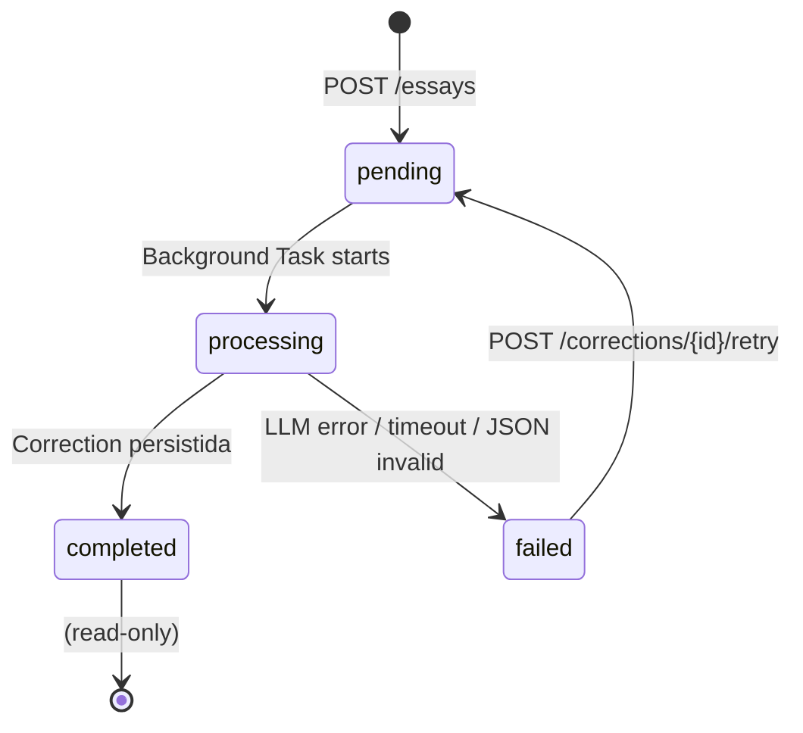

# Submissão de redação

> Documento NOVO (v2.0). Fluxo de envio de redação pelo aluno: texto/upload, limites, parser de arquivo.

---

## Visão geral

O aluno submete uma redação por **uma de duas formas**:

1. **Texto colado** no textarea (source = `text`)
2. **Upload de arquivo** `.txt` ou `.docx` (source = `file`)

Em ambos os casos o backend valida, conta palavras, aplica rate limits/caps e dispara a correção assíncrona.

---

## Regras de validação

| Regra | Valor | Erro |
|---|---|---|
| Mínimo de palavras | 150 | 422 "Redação muito curta (mín 150 palavras)" |
| Máximo de palavras | 1500 | 422 "Redação muito longa (máx 1500 palavras)" |
| Formato aceito | `.txt`, `.docx` | 415 "Formato não suportado" |
| Tamanho máx do arquivo | 100 KB | 413 "Arquivo muito grande" |
| Codificação | UTF-8 | 422 "Falha ao decodificar texto" |

> Refletido no schema do ENEM (mín 30 linhas ~ 150 palavras; ~1500 é folga para captar digitação longa).

---

## Texto colado

Frontend (`EssayForm.tsx`):

```tsx
<Form action={async (formData) => { await submitEssay(formData) }}>
  <Textarea name="content" minLength={150*6} maxLength={1500*8} required />
  <FreeTierCounter used={used} max={max} />
  <Button type="submit" disabled={used >= max}>Corrigir agora</Button>
</Form>
```

Server Action (`lib/actions/essays.ts`):

```ts
async function submitEssay(formData: FormData) {
  const content = formData.get("content") as string;
  const wordCount = countWords(content);
  if (wordCount < 150 || wordCount > 1500) throw new Error(...);
  const res = await api.POST("/essays", { body: { content, source: "text", title } });
  redirect(`/redacoes/${res.id}?polling=true`);
}
```

---

## Upload de arquivo

### Frontend

`EssayForm` alterna entre tabs `Texto` e `Arquivo`. O tab `Arquivo` usa `<input type="file" accept=".txt,.docx">`.

### Backend (`POST /essays` com multipart)

```python
@router.post("/essays")
async def create_essay_from_file(
    file: UploadFile = File(...),
    user: User = Depends(get_current_user),
    db: AsyncSession = Depends(get_db),
):
    if file.filename.endswith(".txt"):
        text = await text_parser.parse_txt(file)
    elif file.filename.endswith(".docx"):
        text = await text_parser.parse_docx(file)
    else:
        raise HTTPException(415, "Formato não suportado")

    word_count = count_words(text)
    validate_word_range(word_count)

    essay = await create_essay(db, user.id, text, word_count, source="file", file_url=...)
    return essay
```

### Parser (`apps/api/app/services/text_parser.py`)

```python
async def parse_txt(file: UploadFile) -> str:
    raw = await file.read()
    for enc in ("utf-8", "latin1"):
        try:
            return raw.decode(enc)
        except UnicodeDecodeError:
            continue
    raise HTTPException(422, "Falha ao decodificar texto")

async def parse_docx(file: UploadFile) -> str:
    raw = await file.read()
    document = DocxDocument(BytesIO(raw))   # python-docx
    return "\n".join(p.text for p in document.paragraphs if p.text.strip())
```

### Dependências (`requirements.txt`)

```
python-docx>=1.1
```

### Sanitização

- Remover Zero-width chars, normalizar quebras de linha para `\n`
- Strip espaços/tab inicial
- Concatenar quebras duplas que estão no meio de parágrafos comuns (heurística simples)
- Não incluir imagens/embeddings (somenteparágrafo de texto)

---

## Endpoint unificado

`POST /essays` aceita ambos:
- `application/json` com `{content, source, title?}`
- `multipart/form-data` com `file` e `title` opcional

Em ambos, a resposta é a mesma: `EssayResponse` (`id, status, word_count, created_at`).

---

## Rate limits & caps aplicados

(Antes de criar a redação)

1. Rate limit HTTP: `60/minute` por IP (slowapi)
2. Cap submissão: `5 essays/hora` por user (`rate_limiter.check_essay_hourly_cap`)
3. Cap de plano: `corrections_used < max_corrections` (`rate_limiter.check_subscription_cap`)

→ Se cap de plano falhar: HTTP **402 Payment Required** com body:
```json
{"error": {"code": "subscription_limit_reached", "message": "Você atingiu seu limite. Faça upgrade para continuar.", "upgrade_url": "/planos"}}
```

Ver [rate-limiting.md](../api/rate-limiting.md).

---

## Counting de palavras

```python
def count_words(text: str) -> int:
    # Semelhante a word_count do Word mantém hifens junto, rangos normalizadas
    return len(re.findall(r"\b[\wÀ-ú\-]+\b", normalize_whitespace(text), flags=re.UNICODE))
```

---

## Status transitions



---

## Privacy

- Conteúdo NUNCA logado em Sentry/Logflare (estrutura só: `{"event":"essay.created","essay_id":...,"word_count":320}`)
- RLS garante que só o dono recupera o `content`
- Retenção de 12 meses → depois, `content` sobrescrito por hash anônimo. Ver [lgpd-compliance.md](./lgpd-compliance.md).