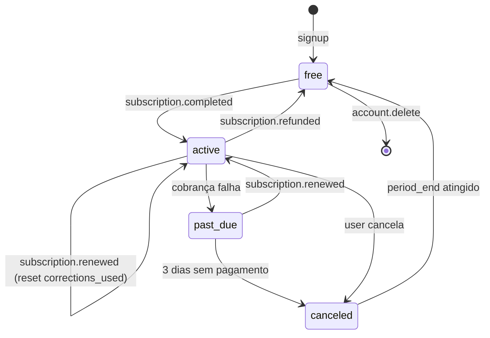

# Assinaturas

> Documento NOVO (v2.0). Modelo de planos, limites, reconciliação, change/cancel flows.

---

## Modelo de planos

| Plano | Preço | Ciclo | Correções por ciclo | Observação |
|---|---|---|---|---|
| Free | R$ 0 | — | **5 vitalícias** (não reseta) | Plano default no signup |
| Mensal | R$ 9,90 | 30 dias | 30 | Ciclo AbacatePay `MONTHLY` |
| Trimestral | R$ 25,20 | 90 dias | 30 (90 total = 30/mês) | Implementado como `cycle: MONTHLY` + 3 cobranças; DB marca `plan='quarterly'` + `period_end = now() + 90d`. Ver [payments-abacatepay.md](./payments-abacatepay.md). |
| Anual | R$ 82,80 | 365 dias | 30/mês (= 360 total anual) | Ciclo AbacatePay `ANNUALLY` |

> Importante: o limite de 30 correções **por ciclo** (30/90/365 dias), não por mês. Para trimestral/anual, ao chegar `subscription.renewed` (cobrança mensal), reinicia `corrections_used=0`.

---

## Tabela de invariáveis

| Estado | Regra |
|---|---|
| Free | `max_corrections = 5`, `corrections_used` nunca decrementa, vitalício |
| Pago ativo | `corrections_used < max_corrections` OU `max_corrections IS NULL` (não usado) |
| Pago `past_due` | Mantém ativo por período de tolerância (3 dias) — ver § Fluxo `past_due` |
| Pago `canceled` | Mantém acesso até `period_end`, depois downgrade para free (não zera corrections_used) |
| Pago `expired` | Downgrade para free; `max_corrections = 5`, `corrections_used` continua |
| Refunded | Downgrade imediato para free |

---

## Estados da assinatura



---

## Reset de `corrections_used`

- **Free:** nunca reseta
- **Pago:** reseta em cada `subscription.renewed` (webhook AbacatePay)
- Job de reconciliação garante reset mesmo se webhook perdido

```python
# services/subscription_service.py
async def reset_cycle_usage(db, user_id: UUID, new_period_end: datetime):
    sub = await get_subscription(db, user_id)
    sub.corrections_used = 0
    sub.period_end = new_period_end
    sub.status = "active"
    await db.commit()
```

---

## Fluxo de cancelamento

```
Usuário clica "Cancelar" na tela /conta
↓
POST /subscriptions/cancel
↓
API chama AbacatePay POST /subscriptions/cancel
↓
Webhook subscription.cancelled
↓
subscriptions.status = 'canceled'; mantém access até period_end
↓
Job diário verifica subs canceled com period_end <= now()
   → downgrade para free (max_corrections=5, status='active', plan='free')
```

### Resposta

- `200 OK` se cancelamento bem-sucedido no AbacatePay
- `409 conflict` se status atual != `'active'`

---

## Fluxo de mudança de plano (change-plan)

No MVP, mudança de plano só pode ser à **substituição**:
- Cancele o plano atual → espere `period_end` expirar
- Assine novo plano via `/subscriptions/checkout`

Atalho (v2.0): admin pode fazer troca manual via [admin/subscriptions-admin.md](../../admin/subscriptions-admin.md) (grant de plano diretamente, fora do AbacatePay — modelo "cortesia").

Tela `/planos` mostra nota: "Para trocar, cancele e reative."

---

## Job de reconciliação diária

`services/subscription_service.py::reconcile_subscriptions()` roda como cron task (life.cycle FastAPI, ou Railway Cron):

1. `GET /subscriptions` do AbacatePay (paginado)
2. Para cada sub Abacate com `customer_id` mapeado ao nosso user:
   - Compara `status`, `period_end`
   - Se divergente, atualiza + insere `admin_audit_log` automático + `webhook_events(event_type='reconciliation.drift')`
3. Cancelados com `period_end <= now()` → downgrade para free
4. Renovados não recebidos (webhook perdido) → aplica o reset de `corrections_used`

### Scheduling

- Railway Cron: `0 3 * * *` (03:00 UTC = meia-noite BRT) → chama `POST /internal/reconcile` (rota protegida por API key de sistema — não por user)

---

## Grant manual (admin)

O admin pode conceder benefícios sem passar pelo AbacatePay:

| Ação | Efeito |
|---|---|
| Grant N correções avulsas | `max_corrections += N` (null + N = null caso unlimited) |
| Grant de plano por X dias | `plan = <plano>`, `max_corrections = 30`, `period_end = now() + X dias`, `abacate_subscription_id = null` (admin grant) |
| Estender `period_end` | `period_end += N dias` |

→ Sempre registrado em `admin_audit_log`. Ver [admin/subscriptions-admin.md](../../admin/subscriptions-admin.md).

---

## Expirou o trial / Fim do ciclo

- Ao expirar `period_end` (job detectou): `plan='free'`, `max_corrections=5`, `status='active'`
- `corrections_used` NÃO é zerado no downgrade (honestidade sobre uso histórico)
- Email "Sua assinatura expirou → renove" (template `upgrade-reminder`, ver [emails.md](./emails.md))